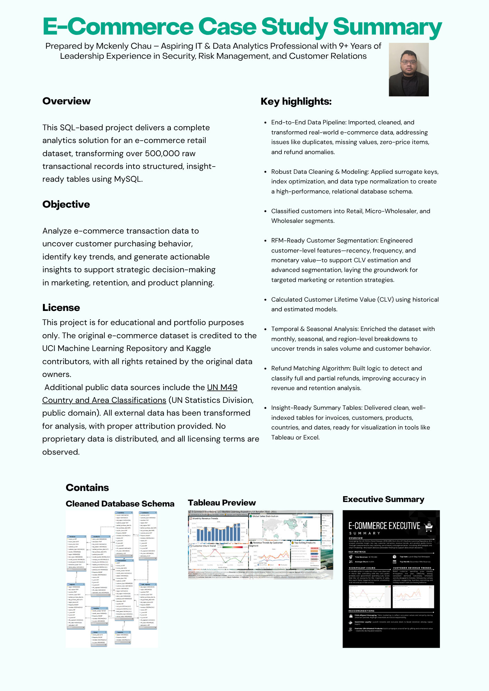
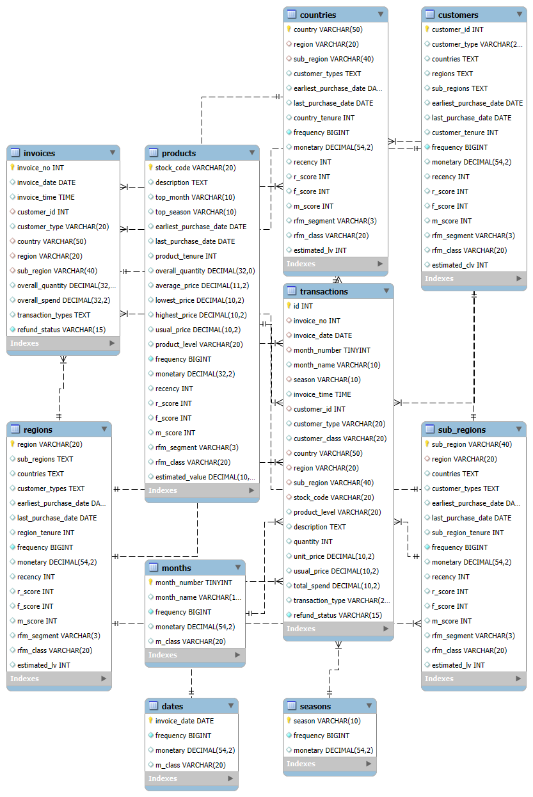
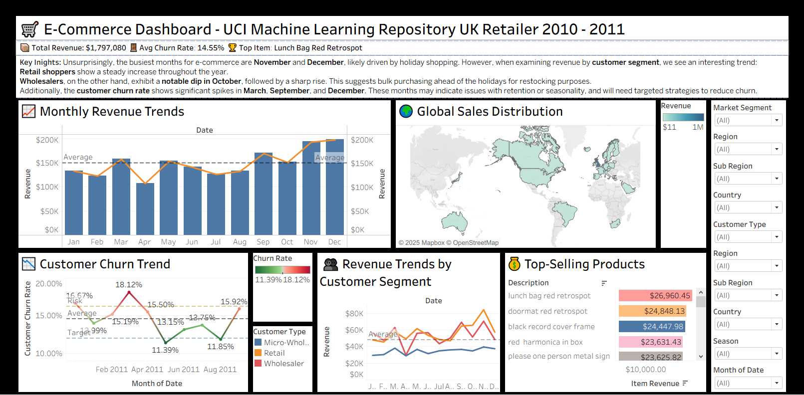
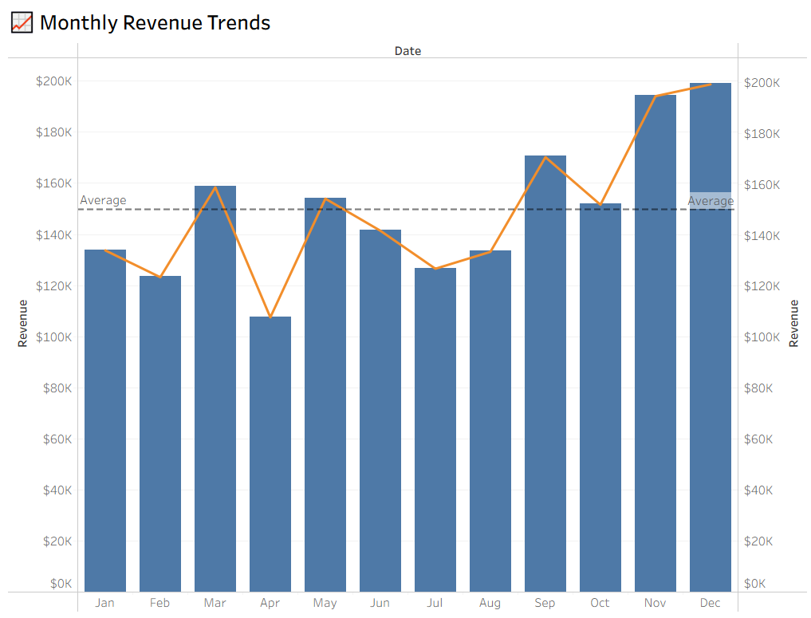
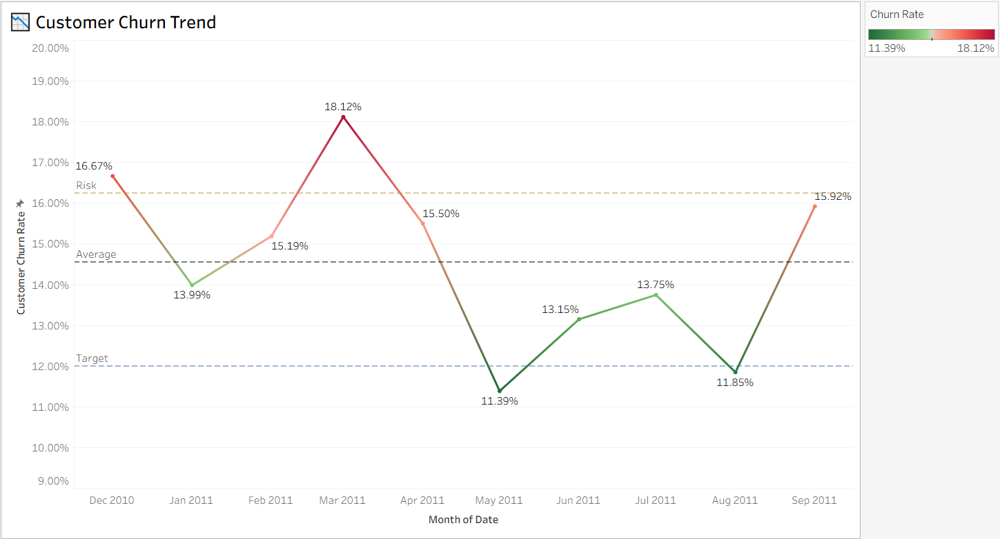
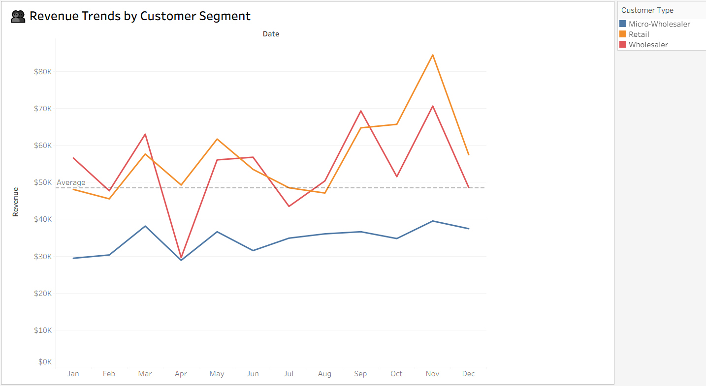
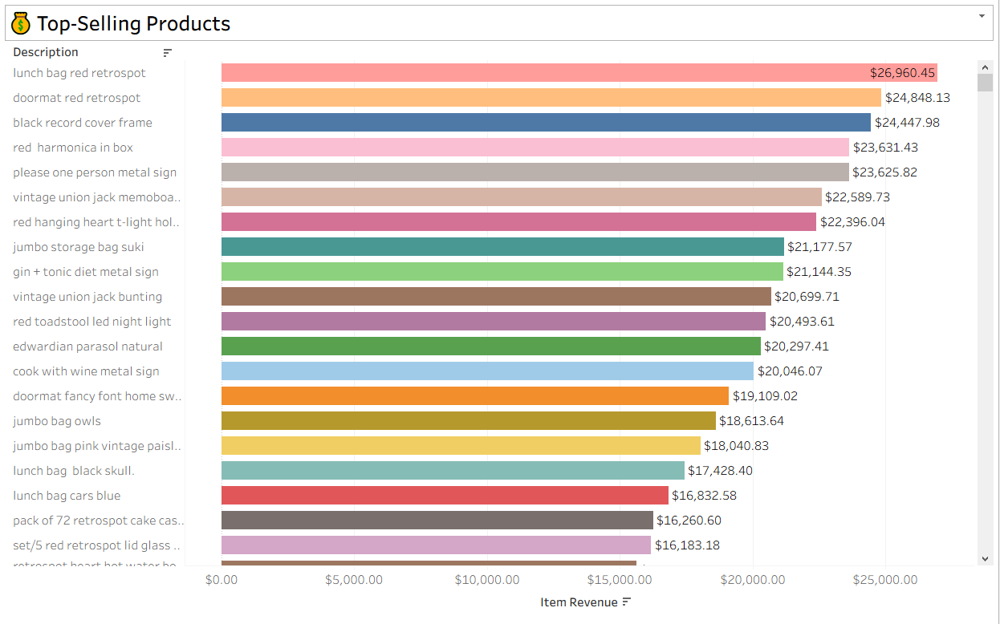
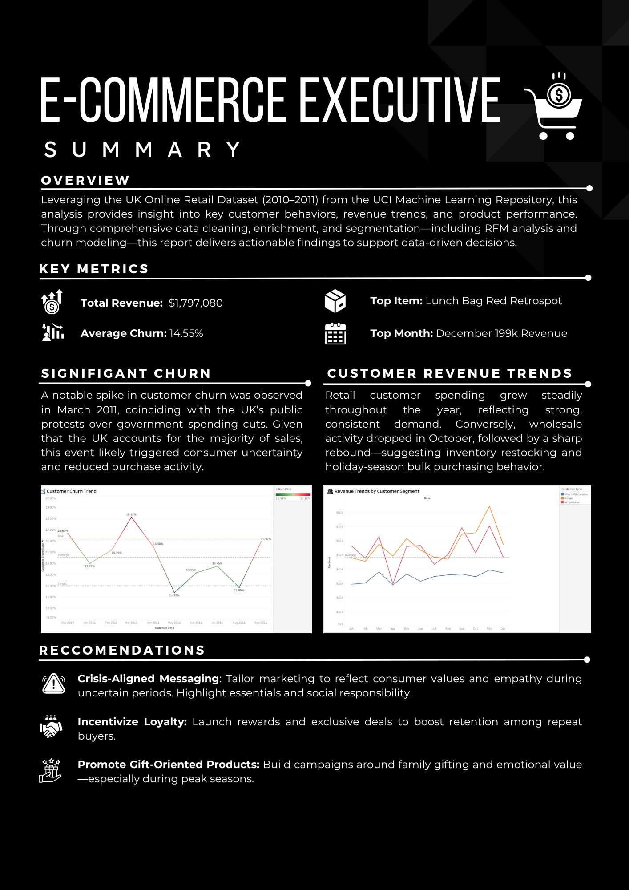

# 🛒 E-commerce Case Study

## 📚 Contents

- [📌 Project Goal](#-project-goal)
- [📋 Project Summary](#-project-summary)
- [📊 Dataset](#-dataset)
- [🧰 Tools Used](#-tools-used)
- [🗂️ Database Setup](#-database-setup)
- [📥 Data Import](#-data-import)
- [🧪 Data Audit](#-data-audit)
- [🧹 Data Cleaning](#-data-cleaning)
- [🔄 Data Manipulation](#-data-manipulation)
- [📊 Data Exploration](#-data-exploration)
- [🧠 Data Enrichment](#-data-enrichment)
- [🗃️ Cleaned Database](#️-cleaned-database)
- [🖼️ Data Visuals](#️-data-visuals)
- [📈 Data Analysis](#-data-analysis)
- [📄 License](#-license)

## 📌 Project Goal  
Analyze e-commerce transaction data to uncover customer purchasing behavior, identify key trends, and generate actionable insights to support strategic decision-making in marketing, retention, and product planning.

---

## 📋 Project Summary
<details>
<summary>📚 Contents</summary>

[](files/e_commerce_case_study_summary.pdf)

</details>
---

## 📊 Dataset
<details>
<summary>📚 Contents</summary>
  
- **Source**: [Kaggle - E-commerce Data](https://www.kaggle.com/datasets/carrie1/ecommerce-data/data)  
- **Original Provider**: UCI Machine Learning Repository  
- **Details**:  
  This dataset includes online retail transactions from 2010 to 2011, primarily for a UK-based retailer.

⚠️ *Due to licensing constraints, the dataset is not stored in this repository.*

To replicate:
1. Download from Kaggle.
2. Export the Excel file as a **UTF-8 CSV**.
3. Move the `.csv` to:  
   `C:\ProgramData\MySQL\MySQL Server 8.0\Uploads`
</details>
---

## 🧰 Tools Used
<details>
<summary>📚 Contents</summary>

- **Database**: MySQL 8.0
- **Environment**: MySQL Workbench, Tableau Public, 2025.2 & Microsoft Excel (365)
</details>
---

## 🗂️ Database Setup
<details>
<summary>📚 Contents</summary>

### 1️⃣ Create the Database
```sql
CREATE DATABASE e_commerce_case_study;
```

### 2️⃣ Create the Table
<details>
<summary>📟 Code</summary>

```sql
CREATE TABLE e_commerce_events (
  invoice_no VARCHAR(20),
  stock_code VARCHAR(20),
  description TEXT,
  quantity INT,
  invoice_date VARCHAR(50),
  unit_price DECIMAL(10,2),
  customer_id INT,
  country VARCHAR(50)
);
```
</details>
</details>
---

## 📥 Data Import
<details>
<summary>📚 Contents</summary>

### Load Data from CSV
<details>
<summary>📟 Code</summary>

```sql
LOAD DATA INFILE 'C:/ProgramData/MySQL/MySQL Server 8.0/Uploads/data.csv'
INTO TABLE e_commerce_events
CHARACTER SET utf8mb4
FIELDS TERMINATED BY ',' ENCLOSED BY '"'
LINES TERMINATED BY '\n'
IGNORE 1 ROWS
(invoice_no, stock_code, description, quantity, invoice_date,
 unit_price, @customer_id, country)
SET customer_id = NULLIF(@customer_id, '');
```
</details>

|invoice_no|stock_code|description                       |quantity|unit_price|total_spend|customer_id|country        |invoice_date       |
|----------|----------|----------------------------------|--------|----------|-----------|-----------|---------------|-------------------|
|536365    |85123A    |WHITE HANGING HEART T-LIGHT HOLDER|6       |2.55      |15.30      |17850      |United Kingdom |2010-12-01 08:26:00|
|536365    |71053     |WHITE METAL LANTERN               |6       |3.39      |20.34      |17850      |United Kingdom |2010-12-01 08:26:00|
|536365    |84406B    |CREAM CUPID HEARTS COAT HANGER    |8       |2.75      |22.00      |17850      |United Kingdom |2010-12-01 08:26:00|

### ⚠️ Notes
- `customer_id` is set to `NULL` if empty
- Some `unit_price` values below 0.01 were truncated
- File must be encoded in **UTF-8**
---
</details>

## 🧪 Data Audit
<details>
<summary>📚 Contents</summary>

- [📅 Date Range](#-date-range)
- [📊 High-Level Overview](#-high-level-overview)
- [🔁 Detect Duplicates](#-detect-duplicates)
- [⚠️ NULL Value Checks](#️-null-value-checks)
- [💸 Zero Unit Price](#-zero-unit-price)
- [💰 High-Value Items](#-high-value-items)
- [🔄 Refund Invoices (Start with "C")](#-refund-invoices-start-with-c)
- [🔻 Negative Quantities Without ‘C’ Invoices](#-negative-quantities-without-c-invoices)
- [🧪 Sample Checks](#-sample-checks)
- [🔣 Non-Item Stock Codes](#-non-item-stock-codes)

### 📅 Date Range
<details>
<summary>📟 Code</summary>

```sql
SELECT MIN(invoice_date), MAX(invoice_date)
FROM e_commerce_events;
```
</details>

|MIN(invoice_date)  |MAX(invoice_date)  |
|-------------------|-------------------|
|2010-12-01 08:26:00|2011-12-09 12:50:00|

### 📊 High-Level Overview
<details>
<summary>📟 Code</summary>

```sql
SELECT 
  COUNT(*) AS total_rows,
  COUNT(DISTINCT invoice_no) AS unique_invoices,
  COUNT(DISTINCT customer_id) AS unique_customers,
  COUNT(DISTINCT stock_code) AS unique_products
FROM e_commerce_events;
```
</details>

|total_rows|unique_invoices|unique_customers|unique_products|
|----------|---------------|----------------|---------------|
|541909    |25900          |4372            |3958           |

### 🔁 Detect Duplicates
<details>
<summary>📟 Code</summary>

```sql
WITH dup_cte AS (
  SELECT COUNT(*) AS dup_count
  FROM e_commerce_events
  GROUP BY invoice_no, stock_code, description, quantity, invoice_date, unit_price, customer_id, country
  HAVING COUNT(*) > 1
) -- CTE to Count Duplicates
SELECT SUM(dup_count - 1) AS redundant_rows
FROM dup_cte;
```
</details>

|redundant_rows|
|--------------|
|5268          |


### ⚠️ NULL Value Checks
<details>
<summary>📟 Code</summary>

```sql
SELECT *
FROM e_commerce_events
WHERE invoice_no IS NULL 
OR stock_code IS NULL 
OR description IS NULL
OR quantity IS NULL 
OR unit_price IS NULL 
OR customer_id IS NULL
OR country IS NULL 
OR invoice_date IS NULL;
```
</details>

|invoice_no|stock_code|description                    |quantity|unit_price|total_spend|customer_id|country        |invoice_date       |
|----------|----------|-------------------------------|--------|----------|-----------|-----------|---------------|-------------------|
|536414    |22139     |                               |56      |0.00      |0.00       |NULL       |United Kingdom |2010-12-01 11:52:00|
|536544    |21773     |DECORATIVE ROSE BATHROOM BOTTLE|1       |2.51      |2.51       |NULL       |United Kingdom |2010-12-01 14:32:00|
|536544    |21774     |DECORATIVE CATS BATHROOM BOTTLE|2       |2.51      |5.02       |NULL       |United Kingdom |2010-12-01 14:32:00|

**Insight:** Only `customer_id` contains NULLs.

### 💸 Zero Unit Price
<details>
<summary>📟 Code</summary>

```sql
SELECT *
FROM e_commerce_events
WHERE unit_price = 0;
```
</details>

|invoice_no|stock_code|description                    |quantity|unit_price|total_spend|customer_id|country        |invoice_date       |
|----------|----------|-------------------------------|--------|----------|-----------|-----------|---------------|-------------------|
|536414    |22139     |                               |56      |0.00      |0.00       |NULL       |United Kingdom |2010-12-01 11:52:00|
|536545    |21134     |                               |1       |0.00      |0.00       |NULL       |United Kingdom |2010-12-01 14:32:00|
|536546    |22145     |                               |1       |0.00      |0.00       |NULL       |United Kingdom |2010-12-01 14:33:00|

**Insight:** Often paired with NULL `customer_id`; may indicate bundled items.
<details>
<summary>📟 Code</summary>

```sql
SELECT *
FROM e_commerce_events
WHERE unit_price = 0 AND customer_id IS NOT NULL;
```
</details>

|invoice_no|stock_code|description                    |quantity|unit_price|total_spend|customer_id|country        |invoice_date       |
|----------|----------|-------------------------------|--------|----------|-----------|-----------|---------------|-------------------|
|537197    |22841     |ROUND CAKE TIN VINTAGE GREEN   |1       |0.00      |0.00       |12647      |Germany        |2010-12-05 14:02:00|
|539263    |22580     |ADVENT CALENDAR GINGHAM SACK   |4       |0.00      |0.00       |16560      |United Kingdom |2010-12-16 14:36:00|
|539722    |22423     |REGENCY CAKESTAND 3 TIER       |10      |0.00      |0.00       |14911      |EIRE           |2010-12-21 13:45:00|

**Insight:** Valid customers with free items — likely promotional.

### 💰 High-Value Items
<details>
<summary>📟 Code</summary>

```sql
SELECT *
FROM e_commerce_events
ORDER BY unit_price DESC
LIMIT 200;
```
</details>

|invoice_no|stock_code|description                    |quantity|unit_price|total_spend|customer_id|country        |invoice_date       |
|----------|----------|-------------------------------|--------|----------|-----------|-----------|---------------|-------------------|
|C556445   |M         |Manual                         |-1      |38970.00  |-38970.00  |15098      |United Kingdom |2011-06-10 15:31:00|
|C580605   |AMAZONFEE |AMAZON FEE                     |-1      |17836.46  |-17836.46  |NULL       |United Kingdom |2011-12-05 11:36:00|
|C540117   |AMAZONFEE |AMAZON FEE                     |-1      |16888.02  |-16888.02  |NULL       |United Kingdom |2011-01-05 09:55:00|


***Insight:** Highest value items include mainly Manuals and AMAZON fees. They also have negative quantities. Will consider deleting.

### 🔄 Refund Invoices (Start with "C")
<details>
<summary>📟 Code</summary>

```sql
SELECT * FROM e_commerce_events WHERE invoice_no LIKE 'C%';
```
</details>

|invoice_no|stock_code|description                    |quantity|unit_price|total_spend|customer_id|country        |invoice_date       |
|----------|----------|-------------------------------|--------|----------|-----------|-----------|---------------|-------------------|
|C536379   |D         |Discount                       |-1      |27.50     |-27.50     |14527      |United Kingdom |2010-12-01 09:41:00|
|C536383   |35004C    |SET OF 3 COLOURED  FLYING DUCKS|-1      |4.65      |-4.65      |15311      |United Kingdom |2010-12-01 09:49:00|
|C536391   |22556     |PLASTERS IN TIN CIRCUS PARADE  |-12     |1.65      |-19.80     |17548      |United Kingdom |2010-12-01 10:24:00|

**Insight:** Negative `quantity`, likely refunds.

### 🔻 Negative Quantities Without ‘C’ Invoices
<details>
<summary>📟 Code</summary>

```sql
SELECT * 
FROM e_commerce_events 
WHERE quantity < 0 AND invoice_no NOT LIKE 'C%';
```
</details>

|invoice_no|stock_code|description|quantity|unit_price|total_spend|customer_id|country        |invoice_date       |
|----------|----------|-----------|--------|----------|-----------|-----------|---------------|-------------------|
|537032    |21275     |?          |-30     |0.00      |0.00       |NULL       |United Kingdom |2010-12-03 16:50:00|
|537425    |84968F    |check      |-20     |0.00      |0.00       |NULL       |United Kingdom |2010-12-06 15:35:00|
|537426    |84968E    |check      |-35     |0.00      |0.00       |NULL       |United Kingdom |2010-12-06 15:36:00|

***Insight:** Possible damaged goods or stock adjustments.

### 🧪 Sample Checks
<details>
<summary>📟 Code</summary>

```sql
SELECT * FROM e_commerce_events WHERE stock_code = '85175';
SELECT * FROM e_commerce_events WHERE invoice_no = '541993';
SELECT * FROM e_commerce_events WHERE stock_code = '21035';
```
</details>

**Insight:** Pricing anomalies and missing `customer_id` suggest outliers.

### 🔣 Non-Item Stock Codes
<details>
<summary>📟 Code</summary>

```sql
SELECT DISTINCT stock_code
FROM e_commerce_events
WHERE stock_code NOT REGEXP '[0-9]';
```
</details>

|stock_code  |
|------------|
|POST        |
|D           |
|M           |
|BANK CHARGES|
|PADS        |
|DOT         |
|CRUK        |

***Insight:** Includes POST(postage), D(discount), M(manual), BANK CHARGES, DOT(dotcom postage), CRUK(cruk commission), and PADS
</details>
---

## 🧹 Data Cleaning
<details>
<summary>📚 Contents</summary>

- [🕒 Convert Date Formats](#-convert-date-formats)
- [💾 Create Backup Before Modifications](#-create-backup-before-modifications)
- [🆔 Add Surrogate Row Identifier](#-add-surrogate-row-identifier)
- [🗑️ Remove Duplicate Records](#️-remove-duplicate-records)
- [🚫 Remove Rows Without Customer ID](#-remove-rows-without-customer-id)
- [🚫 Remove Free or Promotional Item](#-remove-free-or-promotional-item)
- [🔄 Categorize Transaction Type](#-categorize-transaction-type)
- [🧼 Clean Stock Code for Non-item Transactions](#-clean-stock-code-for-non-item-transactions)
- [🔧 Clean Invoice Numbers](#-clean-invoice-numbers)
- [✂️ Normalize Product Descriptions](#️-normalize-product-descriptions)
- [⏱️ Separate Date and Time Fields](#️-separate-date-and-time-fields)
- [🧹 Column Order Cleanup](#-column-order-cleanup)
- [✅ Confirm Column Data Types](#-confirm-column-data-types)
- [🧾 High-Level Metrics After Cleaning](#-high-level-metrics-after-cleaning)
- [🚀 Add Indexes for Query Optimization](#-add-indexes-for-query-optimization)

### 🕒 Convert Date Formats
<details>
<summary>📟 Code</summary>

```sql
ALTER TABLE e_commerce_events ADD invoice_dt DATETIME;
UPDATE e_commerce_events
SET invoice_dt = STR_TO_DATE(invoice_date, '%m/%d/%Y %H:%i');
ALTER TABLE e_commerce_events DROP COLUMN invoice_date;
ALTER TABLE e_commerce_events CHANGE invoice_dt invoice_date DATETIME; 
```
</details>

### 💾 Create Backup Before Modifications
<details>
<summary>📟 Code</summary>

```sql
CREATE TABLE e_commerce_events_backup AS
SELECT * FROM e_commerce_events;
```
</details>

***Insight:** Backing up table before any major changes.

### 🆔 Add Surrogate Row Identifier
<details>
<summary>📟 Code</summary>

```sql
ALTER TABLE e_commerce_events
ADD COLUMN id INT NOT NULL AUTO_INCREMENT PRIMARY KEY FIRST;
```
</details>

***Insight:** Applying surrogate id in order to make eliminating duplicates easier

### 🗑️ Remove Duplicate Records
<details>
<summary>📟 Code</summary>

```sql
WITH duplicate_ids AS (
  SELECT MIN(id) AS keep_id
  FROM e_commerce_events
  GROUP BY invoice_no, stock_code, description, quantity, invoice_date, unit_price, customer_id, country
)
DELETE FROM e_commerce_events
WHERE id NOT IN (
  SELECT keep_id FROM duplicate_ids
);
```
</details>

### 🚫 Remove Rows Without Customer ID
<details>
<summary>📟 Code</summary>

```sql
DELETE FROM e_commerce_events
WHERE customer_id IS NULL;
```
</details>

***Insight:** Unable to attribute to a customer so elimated to remove bad data

### 🚫 Remove Free or Promotional Item
<details>
<summary>📟 Code</summary>

```sql
DELETE FROM e_commerce_events
WHERE unit_price = 0;
```
</details>

***Insight:** As these are additive items they are not necessary for analysis.

### 🔄 Categorize Transaction Type
<details>
<summary>📟 Code</summary>

```sql
ALTER TABLE e_commerce_events ADD transaction_type VARCHAR(20);
UPDATE e_commerce_events
SET transaction_type = 
  CASE
    WHEN invoice_no LIKE 'C%' THEN 'Refund'
    WHEN stock_code = 'POST' THEN 'Postage'
    WHEN stock_code = 'D' THEN 'Discount'
    WHEN stock_code = 'M' THEN 'Manual'
    WHEN stock_code = 'BANK CHARGES' THEN 'Bank Charges'
    WHEN stock_code = 'DOT' THEN 'Dotcom Postage'
    WHEN stock_code = 'CRUK' THEN 'CRUK Commission'
    WHEN stock_code = 'PADS' THEN 'Pads'
    ELSE 'Purchase'
  END;
```
</details>

### 🧼 Clean Stock Code for Non-item Transactions
<details>
<summary>📟 Code</summary>

```sql
UPDATE e_commerce_events
SET stock_code = NULL
WHERE stock_code IN ('POST', 'D', 'M', 'BANK CHARGES', 'DOT', 'CRUK', 'PADS');
```
</details>

***Insight:** Adjusted for clarity

### 🔧 Clean Invoice Numbers
<details>
<summary>📟 Code</summary>

```sql
UPDATE e_commerce_events
SET invoice_no = 
  CASE
    WHEN invoice_no LIKE 'C%' THEN SUBSTRING(invoice_no, 2)
    ELSE invoice_no
  END; 
ALTER TABLE e_commerce_events
MODIFY invoice_no INT;
```
</details>

***Insight:** Adjusted for clarity

### ✂️ Normalize Product Descriptions
<details>
<summary>📟 Code</summary>

```sql
UPDATE e_commerce_events
SET description = LOWER(TRIM(description));
```
</details>

### ⏱️ Separate Date and Time Fields
<details>
<summary>📟 Code</summary>

```sql
ALTER TABLE e_commerce_events
ADD COLUMN invoice_date_only DATE,
ADD COLUMN invoice_time_only TIME; 
UPDATE e_commerce_events
SET
  invoice_date_only = DATE(invoice_date),
  invoice_time_only = TIME(invoice_date);
ALTER TABLE e_commerce_events
DROP COLUMN invoice_date;
ALTER TABLE e_commerce_events
CHANGE invoice_date_only invoice_date DATE,
CHANGE invoice_time_only invoice_time TIME; 
```
</details>

***Insight:** Separated for easier analysis.

### 🧹 Column Order Cleanup
<details>
<summary>📟 Code</summary>

```sql
ALTER TABLE e_commerce_events 
MODIFY COLUMN invoice_date DATE AFTER invoice_no;
ALTER TABLE e_commerce_events 
MODIFY COLUMN invoice_time TIME AFTER invoice_date;
ALTER TABLE e_commerce_events 
MODIFY COLUMN customer_id INT AFTER invoice_time;
ALTER TABLE e_commerce_events 
MODIFY COLUMN country VARCHAR(50) AFTER customer_id;
```
</details>

### ✅ Confirm Column Data Types
<details>
<summary>📟 Code</summary>

```sql
DESCRIBE e_commerce_events;
```
</details>

**Insight:** All data types are correct for their columns

### 🧾 High-Level Metrics After Cleaning
<details>
<summary>📟 Code</summary>

```sql
SELECT 
  COUNT(*) AS total_rows,
  COUNT(DISTINCT invoice_no) AS unique_invoices,
  COUNT(DISTINCT customer_id) AS unique_customers,
  COUNT(DISTINCT stock_code) AS unique_products
FROM e_commerce_events;
```
</details>

|total_rows|unique_invoices|unique_customers                  |unique_products|
|----------|---------------|----------------------------------|---------------|
|401560    |22186          |4371                              |3677           |

### 🚀 Add Indexes for Query Optimization
<details>
<summary>📟 Code</summary>

```sql
CREATE INDEX idx_customer_id ON e_commerce_events(customer_id);
CREATE INDEX idx_invoice_no ON e_commerce_events(invoice_no); 
CREATE INDEX idx_stock_code ON e_commerce_events(stock_code);
CREATE INDEX idx_invoice_date ON e_commerce_events(invoice_date); 
```
</details>

**Insight:** for ease of use when searching
</details>
---

## 🔄 Data Manipulation
<details>
<summary>📚 Contents</summary>

- [➕ Calculate and Add Total Spend](#-calculate-and-add-total-spend)
- [🧾 Invoice Summary Table](#-invoice-summary-table)
- [📆 Daily Performance Overview](#-daily-performance-overview)
- [👥 Customer Activity Summary](#-customer-activity-summary)
- [✅ Active Customers Non-Zero Spend](#-active-customers-non-zero-spend)
- [📦 Product Master Table](#-product-master-table)
- [🌍 Country-Level Aggregates](#-country-level-aggregates)
- [🔄 Transaction Type Breakdown](#-transaction-type-breakdown)
- [🔑 Add Primary Keys to Summary Tables](#-add-primary-keys-to-summary-tables)

### ➕ Calculate and Add Total Spend
<details>
<summary>📟 Code</summary>

```sql
ALTER TABLE e_commerce_events ADD total_spend DECIMAL(10,2);
UPDATE e_commerce_events
SET total_spend = unit_price * quantity;
ALTER TABLE e_commerce_events 
MODIFY COLUMN total_spend DECIMAL(10,2) AFTER unit_price;
```
</details>

### 🧾 Invoice Summary Table
<details>
<summary>📟 Code</summary>

```sql
CREATE TABLE invoices AS
SELECT
  invoice_no,
  invoice_date,
  MIN(invoice_time) AS invoice_time, -- Use earliest time per invoice
  customer_id,
  country,
  SUM(quantity) AS overall_quantity,
  SUM(total_spend) AS overall_spend,
  GROUP_CONCAT(DISTINCT transaction_type ORDER BY transaction_type SEPARATOR ', ') AS transaction_types
FROM e_commerce_events
GROUP BY invoice_no, invoice_date, customer_id, country
ORDER BY invoice_no;
```
</details>

|invoice_no|invoice_date|invoice_time                      |customer_id|country        |overall_quantity|overall_spend|transaction_types|
|----------|------------|----------------------------------|-----------|---------------|----------------|-------------|-----------------|
|536365    |2010-12-01  |08:26:00                          |17850      |United Kingdom |40              |139.12       |Purchase         |
|536366    |2010-12-01  |08:28:00                          |17850      |United Kingdom |12              |22.20        |Purchase         |
|536367    |2010-12-01  |08:34:00                          |13047      |United Kingdom |83              |278.73       |Purchase         |

### 📆 Daily Performance Overview
<details>
<summary>📟 Code</summary>

```sql
CREATE TABLE dates AS
SELECT
  invoice_date,
  COUNT(DISTINCT invoice_no) AS invoice_count,
  COUNT(DISTINCT customer_id) AS customer_count,
  GROUP_CONCAT(DISTINCT country ORDER BY country SEPARATOR ', ') AS countries,
  SUM(quantity) AS overall_quantity,
  SUM(total_spend) AS overall_spend,
  GROUP_CONCAT(DISTINCT transaction_type ORDER BY transaction_type SEPARATOR ', ') AS transaction_types
FROM e_commerce_events
GROUP BY invoice_date
ORDER BY invoice_date;
```
</details>

|invoice_date|invoice_count|customer_count|countries                      |overall_quantity|overall_spend|transaction_types                      |
|------------|-------------|--------------|-------------------------------|----------------|-------------|---------------------------------------|
|2010-12-01  |127          |98            |Australia , EIRE , France, Etc |23931           |45867.26     |Manual, Postage, Purchase, Refund      |
|2010-12-02  |160          |117           |EIRE , Germany , United Kingdom|20790           |45656.47     |Bank Charges, Postage, Purchase, Refund|
|2010-12-03  |64           |55            |Belgium , EIRE , France , Etc  |11507           |22553.38     |Manual, Postage, Purchase, Refund      |


###	👥 Customer Activity Summary
<details>
<summary>📟 Code</summary>

```sql
CREATE TABLE customers AS
SELECT
  customer_id,
  MIN(invoice_date) AS earliest_transaction_date,
  MAX(invoice_date) AS latest_transaction_date,
  DATEDIFF(MAX(invoice_date), MIN(invoice_date)) AS customer_tenure_days,
  COUNT(DISTINCT invoice_no) AS invoice_count,
  GROUP_CONCAT(DISTINCT country ORDER BY country SEPARATOR ', ') AS countries,
  SUM(quantity) AS overall_quantity,
  SUM(total_spend) AS overall_spend,
  GROUP_CONCAT(DISTINCT transaction_type ORDER BY transaction_type SEPARATOR ', ') AS transaction_types
FROM e_commerce_events
GROUP BY customer_id
ORDER BY customer_id;
```
</details>

|customer_id|earliest_transaction_date|latest_transaction_date|customer_tenure_days|invoice_count  |countries      |overall_quantity|overall_spend|transaction_types|
|-----------|-------------------------|-----------------------|--------------------|---------------|---------------|----------------|-------------|-----------------|
|12346      |2011-01-18               |2011-01-18             |0                   |2              |United Kingdom |0               |0.00         |Purchase, Refund |
|12347      |2010-12-07               |2011-12-07             |365                 |7              |Iceland        |2458            |4310.00      |Purchase         |
|12348      |2010-12-16               |2011-09-25             |283                 |4              |Finland        |2341            |1797.24      |Postage, Purchase|

**Insight:** Several customers have an overall_spend of 0, which likely indicates full refunds or fully reversed transactions. Similarly, an overall_quantity of 0 may reflect historical refunds or data entry anomalies. Since these records do not provide meaningful analytical value, they may be excluded in later stages of the analysis.

### ✅ Active Customers Non-Zero Spend
<details>
<summary>📟 Code</summary>

```sql
CREATE TABLE valid_customers AS
SELECT *
FROM customers
WHERE overall_spend > 0
AND overall_quantity > 0;
```
</details>

|customer_id|earliest_transaction_date|latest_transaction_date|customer_tenure_days|invoice_count  |countries|overall_quantity|overall_spend|transaction_types|
|-----------|-------------------------|-----------------------|--------------------|---------------|---------|----------------|-------------|-----------------|
|12347      |2010-12-07               |2011-12-07             |365                 |7              |Iceland  |2458            |4310.00      |Purchase         |
|12348      |2010-12-16               |2011-09-25             |283                 |4              |Finland  |2341            |1797.24      |Postage, Purchase|
|12349      |2011-11-21               |2011-11-21             |0                   |1              |Italy    |631             |1757.55      |Postage, Purchase|

**Insight:** This cleaned subset of customers is well-suited for RFM (Recency, Frequency, Monetary) analysis, as it ensures all included records reflect meaningful purchasing behavior.

### 📦 Product Master Table
<details>
<summary>📟 Code</summary>

```sql
CREATE TABLE products AS
WITH mode_cte AS (
  SELECT stock_code, unit_price AS usual_price,
         ROW_NUMBER() OVER (PARTITION BY stock_code ORDER BY COUNT(*) DESC) AS rn
  FROM e_commerce_events
  GROUP BY stock_code, unit_price
), -- CTE to determine the most frequent (mode) unit_price for each stock_code
top_descriptions AS (
  SELECT stock_code, description
  FROM (
    SELECT stock_code, description,
           ROW_NUMBER() OVER (PARTITION BY stock_code ORDER BY COUNT(*) DESC) AS rn
    FROM e_commerce_events
    GROUP BY stock_code, description
  ) ranked
  WHERE rn = 1
), -- CTE to select the most commonly used description per stock_code
mode_filtered AS (
  SELECT stock_code, usual_price
  FROM mode_cte
  WHERE rn = 1
) -- CTE to retain only the most frequent unit_price per product
-- Final product-level aggregation query
SELECT 
  td.stock_code,
  td.description,
  MIN(e.invoice_date) AS earliest_order_date, 
  MAX(e.invoice_date) AS latest_order_date,
  SUM(e.quantity) AS overall_quantity,
  ROUND(AVG(e.unit_price), 2) AS average_price,
  MIN(e.unit_price) AS lowest_price,
  MAX(e.unit_price) AS highest_price,
  mf.usual_price,
  SUM(e.total_spend) AS overall_spend
FROM e_commerce_events e
JOIN top_descriptions td ON e.stock_code = td.stock_code
JOIN mode_filtered mf ON e.stock_code = mf.stock_code
GROUP BY td.stock_code, td.description, mf.usual_price
ORDER BY td.stock_code;
```
</details>

|stock_code|description               |earliest_order_date|latest_order_date|overall_quantity|average_price|lowest_price|highest_price|usual_price|overall_spend|
|----------|--------------------------|-------------------|-----------------|----------------|-------------|------------|-------------|-----------|-------------|
|10002     |inflatable political globe|2010-12-01         |2011-04-18       |823             |0.85         |0.85        |0.85         |0.85       |699.55       |
|10080     |groovy cactus inflatable  |2011-02-27         |2011-11-21       |291             |0.41         |0.39        |0.85         |0.39       |114.41       |
|10120     |doggy rubber              |2010-12-03         |2011-12-04       |192             |0.21         |0.21        |0.21         |0.21       |40.32        |

***Insight:** Standardized product descriptions by assigning the most frequently used description per `stock_code`, ensuring consistency across records for accurate aggregation and analysis.

### 🌍 Country-Level Aggregates
<details>
<summary>📟 Code</summary>

```sql
CREATE TABLE countries AS
SELECT
  country,
  MIN(invoice_date) AS earliest_transaction_date,
  MAX(invoice_date) AS latest_transaction_date,
  COUNT(DISTINCT invoice_no) AS invoice_count,
  COUNT(DISTINCT customer_id) AS customer_count,
  SUM(quantity) AS overall_quantity,
  SUM(total_spend) AS overall_spend,
  ROUND(SUM(total_spend) / COUNT(DISTINCT customer_id), 2) AS avg_spend_per_customer,
  GROUP_CONCAT(DISTINCT transaction_type ORDER BY transaction_type SEPARATOR ', ') AS transaction_types
FROM e_commerce_events
GROUP BY country
ORDER BY country;
```
</details>

|country  |earliest_transaction_date|latest_transaction_date|invoice_count|customer_count |overall_quantity|overall_spend|avg_spend_per_customer|transaction_types|
|---------|-------------------------|-----------------------|-------------|---------------|----------------|-------------|----------------------|-----------------|
|Australia|2010-12-01               |2011-11-24             |69           |9              |83335           |137009.77    |15223.31              |Postage & Etc    |
|Austria  |2010-12-15               |2011-12-08             |19           |11             |4827            |10154.32     |923.12                |Postage & Etc    |
|Bahrain  |2011-05-09               |2011-05-19             |2            |2              |260             |548.40       |274.20                |Purchase         |


### 🔄 Transaction Type Breakdown
<details>
<summary>📟 Code</summary>

```sql
CREATE TABLE transaction_types AS
SELECT
  transaction_type,
  COUNT(DISTINCT invoice_no) AS invoice_count,
  COUNT(DISTINCT customer_id) AS customer_count,
  SUM(quantity) AS overall_quantity,
  SUM(total_spend) AS overall_spend
FROM e_commerce_events
GROUP BY transaction_type
ORDER BY transaction_type;
```
</details>

|transaction_type|invoice_count|customer_count                    |overall_quantity|overall_spend  |
|----------------|-------------|----------------------------------|----------------|---------------|
|Bank Charges    |11           |10                                |11              |165.00         |
|Dotcom Postage  |16           |1                                 |16              |11906.36       |
|Manual          |253          |197                               |6933            |53419.93       |

### 🔑 Add Primary Keys to Summary Tables
<details>
<summary>📟 Code</summary>

```sql
ALTER TABLE invoices ADD PRIMARY KEY (invoice_no);
ALTER TABLE dates ADD PRIMARY KEY (invoice_date);
ALTER TABLE valid_customers ADD PRIMARY KEY (customer_id);
ALTER TABLE countries ADD PRIMARY KEY (country);
ALTER TABLE products ADD PRIMARY KEY (stock_code);
ALTER TABLE transaction_types ADD PRIMARY KEY (transaction_type);
```
</details>
</details>
---

## 📊 Data Exploration
<details>
<summary>📚 Contents</summary>

- [👥 EX-Customers](#-ex-customers)
- [📦 EX-Products](#-ex-products)
- [🧾 EX-Invoices](#-ex-invoices)
- [🌍 EX-Country](#-ex-country)
- [📅 EX-Dates](#-ex-dates)


### 👥 EX-Customers
<details>
<summary>📚 Contents</summary>

- [💰 Top Customer Spenders](#-top-customer-spenders)
- [🔍 Sample Top Customers](#-sample-top-customers)

#### 💰 Top Customer Spenders
<details>
<summary>📟 Code</summary>

```sql
SELECT customer_id,
	customer_tenure_days,
	invoice_count,
  countries,
  overall_quantity,
  overall_spend
FROM e_commerce_case_study.valid_customers 
ORDER BY overall_spend DESC
LIMIT 5;
```
</details>

|customer_id|customer_tenure_days|invoice_count|countries      |overall_quantity|overall_spend|
|-----------|--------------------|-------------|---------------|----------------|-------------|
|14646      |353                 |76           |Netherlands    |196143          |279489.02    |
|18102      |367                 |62           |United Kingdom |64122           |256438.49    |
|17450      |359                 |55           |United Kingdom |69009           |187322.17    |
|14911      |372                 |248          |EIRE           |76905           |132458.73    |
|12415      |313                 |26           |Australia      |76946           |123725.45    |

**Insight:** Several customers consistently exhibit high order volumes and total spending, indicating potential wholesale buyers or bulk purchasers.

### 🔍 Sample Top Customers
<details>
<summary>📟 Code</summary>

```sql
SELECT * FROM e_commerce_events WHERE customer_id = 14646;
SELECT * FROM e_commerce_events WHERE customer_id = 18102;
SELECT * FROM e_commerce_events WHERE customer_id = 17450;
```
</details>

**Insight:** Many of their transactions involve purchasing 100+ units of individual items, reinforcing the likelihood that they are wholesale customers. Further analysis is needed to distinguish wholesalers from regular retail buyers.
</details>

### 📦 EX-Products
<details>
<summary>📟 Code</summary>


- [🏆 Top Products by Revenue](#-top-products-by-revenue)
- [📦 Top Products by Volume](#-top-products-by-volume)

#### 🏆 Top Products by Revenue
<details>
<summary>📟 Code</summary>

```sql
SELECT stock_code,
	description,
    overall_quantity,
    average_price,
    lowest_price,
    highest_price,
    usual_price,
    overall_spend
FROM products
ORDER BY overall_spend DESC;
```
</details>

|stock_code|description                       |overall_quantity|average_price|lowest_price|highest_price|usual_price|overall_spend|
|----------|----------------------------------|----------------|-------------|------------|-------------|-----------|-------------|
|22423     |regency cakestand 3 tier          |11519           |12.44        |4.00        |24.96        |12.75      |132567.70    |
|85123A    |white hanging heart t-light holder|34185           |2.89         |2.40        |5.79         |2.95       |93923.15     |
|85099B    |jumbo bag red retrospot           |44963           |2.01         |1.65        |4.13         |2.08       |83056.52     |

**Insight:** The Regency Cakestand ranks among the top items by `overall_spend`, despite having a lower quantity sold compared to others. This suggests it is a high-value item. Categorizing products into high-end and low-end segments based on `usual_price` may provide more meaningful insights during analysis.

#### 📦 Top Products by Volume
<details>
<summary>📟 Code</summary>

```sql
SELECT stock_code,
	description,
    overall_quantity,
    average_price,
    lowest_price,
    highest_price,
    usual_price,
    overall_spend
FROM products
ORDER BY overall_quantity DESC;
```
</details>

|stock_code|description                      |overall_quantity|average_price|lowest_price|highest_price|usual_price|overall_spend|
|----------|---------------------------------|----------------|-------------|------------|-------------|-----------|-------------|
|84077     |world war 2 gliders asstd designs|53119           |0.29         |0.11        |0.63         |0.29       |13304.49     |
|22197     |popcorn holder                   |48689           |0.84         |0.72        |1.63         |0.85       |36840.33     |
|85099B    |jumbo bag red retrospot          |44963           |2.01         |1.65        |4.13         |2.08       |83056.52     |

**Insight:** Most high-volume products are priced below $1, with only a few exceptions. This reinforces the value of segmenting items into low-end and high-end categories based on `usual_price` for more precise product-level analysis.

**Note** Product categorization was explored but deprioritized due to high variability in descriptions and limited benefit to core business insights.
</details>

### 🧾 EX-Invoices
<details>
<summary>📚 Contents</summary>

- [📊 Largest Orders by Quantity](#-largest-orders-by-quantitys)
- [↩️ Largest Refunds by Quantity](#️-largest-refunds-by-quantity)

#### 📊 Largest Orders by Quantitys
<details>
<summary>📟 Code</summary>

```sql
SELECT * 
FROM invoices
ORDER BY overall_quantity DESC;
```
</details>

|invoice_no|invoice_date              |invoice_time|customer_id|country        |overall_quantity|overall_spend|transaction_types|
|----------|--------------------------|------------|-----------|---------------|----------------|-------------|-----------------|
|581483    |2011-12-09                |09:15:00    |16446      |United Kingdom |80995           |168469.60    |Purchase         |
|541431    |2011-01-18                |10:01:00    |12346      |United Kingdom |74215           |77183.60     |Purchase         |
|556917    |2011-06-15                |13:37:00    |12415      |Australia      |15049           |22775.93     |Purchase         |

#### ↩️ Largest Refunds by Quantity
<details>
<summary>📟 Code</summary>

```sql
SELECT * 
FROM invoices
ORDER BY overall_quantity;
```
</details>

|invoice_no|invoice_date              |invoice_time|customer_id|country        |overall_quantity|overall_spend|transaction_types|
|----------|--------------------------|------------|-----------|---------------|----------------|-------------|-----------------|
|581484    |2011-12-09                |09:27:00    |16446      |United Kingdom |-80995          |-168469.60   |Refund           |
|541433    |2011-01-18                |10:17:00    |12346      |United Kingdom |-74215          |-77183.60    |Refund           |
|536757    |2010-12-02                |14:23:00    |15838      |United Kingdom |-9360           |-280.80      |Refund           |

**Insight:** This is the inverse of large orders by sorting in ascending quantity. Numerous large invoices appear to be refunded shortly after the original purchase. It would be beneficial to identify and label fully refunded orders to improve accuracy in customer and revenue analysis.
</details>

### 🌍 EX-Country
<details>
<summary>📚 Contents</summary>

- [🌍 Top Countries by Invoices](#-top-countries-by-invoices)
- [👥 Top Countries by Customers](#-top-countries-by-customers)
- [📦 Top Countries by Units Sold](#-top-countries-by-units-sold)
- [💸 Top Countries by Total Spend](#-top-countries-by-total-spend)
- [🧾 Top Countries by Avg. Spend per Customer](#-top-countries-by-avg-spend-per-customer)

#### 🌍 Top Countries by Invoices
<details>
<summary>📟 Code</summary>

```sql
SELECT country,
	invoice_count,
    customer_count,
    overall_quantity,
    overall_spend,
    avg_spend_per_customer
FROM countries
ORDER BY invoice_count DESC;
```
</details>

|country        |invoice_count             |customer_count|overall_quantity|overall_spend|avg_spend_per_customer|
|---------------|--------------------------|--------------|----------------|-------------|----------------------|
|United Kingdom |19854                     |3949          |3982134         |6747156.15   |1708.57               |
|Germany        |603                       |95            |117339          |221509.47    |2331.68               |
|France         |458                       |87            |109805          |196626.05    |2260.07               |

#### 👥 Top Countries by Customers
<details>
<summary>📟 Code</summary>

```sql
SELECT country,
	invoice_count,
    customer_count,
    overall_quantity,
    overall_spend,
    avg_spend_per_customer
FROM countries
ORDER BY customer_count DESC;
```
</details>

|country        |invoice_count             |customer_count|overall_quantity|overall_spend|avg_spend_per_customer|
|---------------|--------------------------|--------------|----------------|-------------|----------------------|
|United Kingdom |19854                     |3949          |3982134         |6747156.15   |1708.57               |
|Germany        |603                       |95            |117339          |221509.47    |2331.68               |
|France         |458                       |87            |109805          |196626.05    |2260.07               |

#### 📦 Top Countries by Units Sold
<details>
<summary>📟 Code</summary>

```sql
SELECT country,
	invoice_count,
    customer_count,
    overall_quantity,
    overall_spend,
    avg_spend_per_customer
FROM countries
ORDER BY overall_quantity DESC;
```
</details>

|country        |invoice_count             |customer_count|overall_quantity|overall_spend|avg_spend_per_customer|
|---------------|--------------------------|--------------|----------------|-------------|----------------------|
|United Kingdom |19854                     |3949          |3982134         |6747156.15   |1708.57               |
|Netherlands    |100                       |9             |199552          |284661.54    |31629.06              |
|EIRE           |319                       |3             |135937          |250001.78    |83333.93              |

#### 💸 Top Countries by Total Spend
<details>
<summary>📟 Code</summary>

```sql
SELECT country,
	invoice_count,
    customer_count,
    overall_quantity,
    overall_spend,
    avg_spend_per_customer
FROM countries
ORDER BY overall_spend DESC;
```
</details>

|country        |invoice_count             |customer_count|overall_quantity|overall_spend|avg_spend_per_customer|
|---------------|--------------------------|--------------|----------------|-------------|----------------------|
|United Kingdom |19854                     |3949          |3982134         |6747156.15   |1708.57               |
|Netherlands    |100                       |9             |199552          |284661.54    |31629.06              |
|EIRE           |319                       |3             |135937          |250001.78    |83333.93              |

#### 🧾 Top Countries by Avg. Spend per Customer
<details>
<summary>📟 Code</summary>

```sql
SELECT country,
	invoice_count,
    customer_count,
    overall_quantity,
    overall_spend,
    avg_spend_per_customer
FROM countries
ORDER BY avg_spend_per_customer DESC;
```
</details>

|country     |invoice_count             |customer_count|overall_quantity|overall_spend|avg_spend_per_customer|
|------------|--------------------------|--------------|----------------|-------------|----------------------|
|EIRE        |319                       |3             |135937          |250001.78    |83333.93              |
|Netherlands |100                       |9             |199552          |284661.54    |31629.06              |
|Australia   |69                        |9             |83335           |137009.77    |15223.31              |

**Insight:** Orders from the United Kingdom significantly surpass other countries in both quantity and total spend, which aligns with the dataset’s UK origin. Countries with fewer customers often exhibit a higher average spend per customer, suggesting that international sales may have been limited to wholesale buyers operating in their own domestic markets. It may be valuable to distinguish between domestic and international transactions for clearer segmentation.
</details>

### 📅 EX-Dates
<details>
<summary>📚 Contents</summary>

- [🗓️ Dates with Most Invoices](#️-dates-with-most-invoices)
- [👤 Dates with Most Customers](#-dates-with-most-customers)
- [📈 Dates with Highest Sales Volume](#-dates-with-highest-sales-volume)
- [💳 Dates with Highest Revenue](#-dates-with-highest-revenue)

#### 🗓️ Dates with Most Invoices
<details>
<summary>📟 Code</summary>

```sql
SELECT invoice_date,
invoice_count,
customer_count,
overall_quantity,
overall_spend
FROM e_commerce_case_study.dates
ORDER BY invoice_count DESC;
```
</details>

|invoice_date|invoice_count             |customer_count|overall_quantity|overall_spend|
|------------|--------------------------|--------------|----------------|-------------|
|2011-10-06  |180                       |154           |30848           |52673.62     |
|2011-12-01  |164                       |149           |24582           |43634.37     |
|2011-11-10  |161                       |139           |37780           |68321.01     |

#### 👤 Dates with Most Customers
<details>
<summary>📟 Code</summary>

```sql
SELECT invoice_date,
invoice_count,
customer_count,
overall_quantity,
overall_spend
FROM e_commerce_case_study.dates
ORDER BY customer_count DESC;
```
</details>

|invoice_date|invoice_count             |customer_count|overall_quantity|overall_spend|
|------------|--------------------------|--------------|----------------|-------------|
|2011-10-06  |180                       |154           |30848           |52673.62     |
|2011-12-01  |164                       |149           |24582           |43634.37     |
|2011-11-10  |161                       |139           |37780           |68321.01     |

#### 📈 Dates with Highest Sales Volume
<details>
<summary>📟 Code</summary>

```sql
SELECT invoice_date,
invoice_count,
customer_count,
overall_quantity,
overall_spend
FROM e_commerce_case_study.dates
ORDER BY overall_quantity DESC;
```
</details>

|invoice_date|invoice_count             |customer_count|overall_quantity|overall_spend|
|------------|--------------------------|--------------|----------------|-------------|
|2011-10-05  |99                        |82            |45677           |73626.37     |
|2011-09-20  |71                        |56            |42583           |103327.13    |
|2011-12-07  |117                       |101           |40903           |68867.66     |

#### 💳 Dates with Highest Revenue
<details>
<summary>📟 Code</summary>

```sql
SELECT invoice_date,
invoice_count,
customer_count,
overall_quantity,
overall_spend
FROM e_commerce_case_study.dates
ORDER BY overall_spend DESC;
```
</details>

|invoice_date|invoice_count             |customer_count|overall_quantity|overall_spend|
|------------|--------------------------|--------------|----------------|-------------|
|2011-09-20  |71                        |56            |42583           |103327.13    |
|2011-10-05  |99                        |82            |45677           |73626.37     |
|2011-11-23  |148                       |114           |38035           |70099.27     |

**Insight:** The highest overall quantity and total spend are concentrated in the latter half of the year, indicating a potential seasonal trend. This pattern suggests increased purchasing activity during certain months, likely related to holidays or year-end demand. Further analysis by month and season will help validate and understand these trends.
</details>
</details>
---

## 🧠 Data Enrichment
<details>
<summary>📚 Contents</summary>

- [👥 EN-Customers](#-en-customers)
- [📦 EN-Product](#-en-product)
- [🗓️ EN-Dates](#️-en-dates)
- [🧾 EN-Invoices](#-en-invoices)
- [🌍 EN-Country](#-en-country)
- [📦 Finalized Tables](#-finalized-tables)
- [🧹 Clean Trailing Characters](#-clean-trailing-characters)

### 👥 EN-Customers
<details>
<summary>📚 Contents</summary>

- [🧠 Customer Segmentation by Type](#-customer-segmentation-by-type)
- [📈 Customer Segmentation by Engagement](#-customer-segmentation-by-engagement)
- [🧮 Add CLV Columns](#-add-clv-columns)

#### 🧠 Customer Segmentation by Type
<details>
<summary>📟 Code</summary>

```sql
ALTER TABLE valid_customers
ADD COLUMN customer_type VARCHAR(20);

UPDATE valid_customers
SET customer_type = 
  CASE
    WHEN overall_quantity > 5000
         AND (overall_quantity / invoice_count) > 100
         AND overall_spend > 10000 THEN 'Wholesaler'
	WHEN overall_quantity > 2000
         AND (overall_quantity / invoice_count) > 50
         AND overall_spend > 1000 THEN 'Micro-Wholesaler'
    ELSE 'Retail'
  END;
```
</details>

**Insight:** Customers with an overall quantity exceeding 5,000, an average of more than 100 items per invoice, and total spending above 10,000 strongly indicate wholesale purchasing behavior. Meanwhile, those with over 2,000 items, an average above 50 per invoice, and spending above 1,000 suggest micro-wholesale activity. These thresholds help distinguish wholesalers from regular retail customers by identifying consistent patterns in purchase volume and value.

#### 📈 Customer Segmentation by Engagement
<details>
<summary>📟 Code</summary>

```sql
ALTER TABLE valid_customers
ADD COLUMN customer_level VARCHAR(20);

UPDATE valid_customers
SET customer_level = 
  CASE
  WHEN invoice_count = 1 THEN 'One-Time'
  WHEN invoice_count < 3 AND customer_tenure_days < 30 THEN 'Short-Term'
  WHEN invoice_count >= 3 AND customer_tenure_days < 90 THEN 'Medium-Term'
  WHEN invoice_count >= 5 AND customer_tenure_days >= 90 THEN 'Recurrent'
  ELSE 'Occasional'
END;
```
</details>

**Insight:** Customers are categorized into engagement levels based on the number of days between their first and last transactions `customer_tenure_days` and their total number of invoices `invoice_count`. This segmentation helps classify them as One-Time, Short-Term, Medium-Term, Recurrent, or Occasional customers, providing a clearer understanding of purchasing behavior and loyalty.

#### 🧮 Add CLV Columns
<details>
<summary>📟 Code</summary>

```sql
ALTER TABLE valid_customers
ADD COLUMN customer_lifetime_value DECIMAL(10, 2),
ADD COLUMN estimated_clv DECIMAL(10, 2);

-- Historical CLV: Total spend per customer
UPDATE valid_customers
SET customer_lifetime_value = overall_spend;

-- Estimated CLV using customer_type and customer_level
UPDATE valid_customers
SET estimated_clv = 
  (overall_spend / NULLIF(invoice_count, 0)) *                           -- Average Order Value
  (invoice_count / NULLIF(GREATEST(customer_tenure_days, 1), 0)) *       -- Purchase frequency
  CASE 
    WHEN customer_level = 'One-Time' THEN 0				-- No lifetime value
    WHEN customer_type = 'Wholesaler' THEN 730
    WHEN customer_type = 'Micro-Wholesaler' THEN 365
    WHEN customer_level = 'Short-Term' THEN 60			-- customer_level used for segmenting Retail customers
    WHEN customer_level = 'Medium-Term' THEN 120
    WHEN customer_level = 'Occasional' THEN 180
    WHEN customer_level = 'Recurrent' THEN 365
    ELSE 180  -- Default fallback
  END; 
```
</details>

**Insight:** Customer Lifetime Value (CLV) was calculated by segmenting customers based on their engagement level and purchasing behavior. This approach provides a more tailored estimate of long-term value across Retail, Micro-Wholesaler, and Wholesaler segments.
</details>

### 📦 EN-Product
<details>
<summary>📚 Contents</summary>

- [💰 Product Tier Assignment by Price](#-product-tier-assignment-by-price)

#### 💰 Product Tier Assignment by Price
<details>
<summary>📟 Code</summary>

```sql
ALTER TABLE products
ADD COLUMN product_level VARCHAR(20);

UPDATE products
SET product_level = 
  CASE
    WHEN usual_price > 100 THEN 'Premium'
    WHEN usual_price > 50 THEN 'High'
    WHEN usual_price > 10 THEN 'Mid'
    WHEN usual_price > 1 THEN 'Standard'
    ELSE 'Low'
  END;
```
</details>

**Insight:** Products are categorized into tiers—Premium, High, Mid, Standard, and Low—based on their `usual_price` to reflect relative pricing levels and support more granular product analysis.

**Note** Product return rate was evaluated as a potential metric but ultimately excluded due to the absence of return reason data. Without understanding the context behind refunds (e.g., overordering, defects, or logistical issues), any conclusions drawn would be speculative. Product return rate was considered, but dropped due to not having information as to the cause of return which would have resulted in too much conjecture.
</details>

### 🗓️ EN-Dates
<details>
<summary>📚 Contents</summary>

- [📅 Add Month and Month Number](#-add-month-and-month-number)
- [📊 Monthly Trends Summary Table](#-monthly-trends-summary-table)
- [🌦️ Seasonal Data Columns](#️-seasonal-data-columns)
- [🗂️ Seasonal Summary Table](#️-seasonal-summary-table)

#### 📅 Add Month and Month Number
<details>
<summary>📟 Code</summary>

```sql
ALTER TABLE dates
ADD COLUMN month_number TINYINT,
ADD COLUMN month_name VARCHAR(10);

UPDATE dates
SET 
  month_number = MONTH(invoice_date),
  month_name = DATE_FORMAT(invoice_date, '%b');
  
  ALTER TABLE dates
MODIFY COLUMN month_number TINYINT AFTER invoice_date,
MODIFY COLUMN month_name VARCHAR(10) AFTER month_number;
```
</details>

**Insight:** Added month_number and month_name columns to enhance time-based analysis and enable proper chronological sorting in monthly reports.

#### 📊 Monthly Trends Summary Table
<details>
<summary>📟 Code</summary>

```sql
CREATE TABLE months AS
SELECT 
  month_number,
  month_name,
  SUM(invoice_count) AS invoice_count,
  SUM(customer_count) AS customer_count,
  SUM(overall_quantity) AS overall_quantity,
  SUM(overall_spend) AS overall_spend
FROM dates
GROUP BY month_number, month_name
ORDER BY month_number;
ALTER TABLE months ADD PRIMARY KEY (month_number);
```
</details>

|month_number|month_name                |invoice_count|customer_count|overall_quantity|overall_spend|
|------------|--------------------------|-------------|--------------|----------------|-------------|
|1           |Jan                       |1236         |1116          |268706          |473731.90    |
|2           |Feb                       |1201         |1079          |262227          |435534.07    |
|3           |Mar                       |1619         |1434          |343054          |578576.21    |

#### 🌦️ Seasonal Data Columns
<details>
<summary>📟 Code</summary>

```sql
ALTER TABLE dates
ADD COLUMN season VARCHAR(10);
UPDATE dates
SET season = CASE
	WHEN month_number IN (3,4,5) THEN 'Spring'
    WHEN month_number IN (6,7,8) THEN 'Summer'
    WHEN month_number IN (9,10,11) THEN 'Autumn'
    WHEN month_number IN (12,1,2) THEN 'Winter'
    END;
ALTER TABLE dates
MODIFY COLUMN season VARCHAR(10) AFTER month_name;

ALTER TABLE months
ADD COLUMN season VARCHAR(10);
UPDATE months
SET season = CASE
	WHEN month_number IN (3,4,5) THEN 'Spring'
    WHEN month_number IN (6,7,8) THEN 'Summer'
    WHEN month_number IN (9,10,11) THEN 'Autumn'
    WHEN month_number IN (12,1,2) THEN 'Winter'
    END;
ALTER TABLE months
MODIFY COLUMN season VARCHAR(10) AFTER month_name;
```
</details>

**Note** Seasonal classification is based on the United Kingdom's meteorological seasons, as the dataset originates from the UK.

#### 🗂️ Seasonal Summary Table
<details>
<summary>📟 Code</summary>

```sql
CREATE TABLE seasons AS
SELECT 
  season,
  CASE 
    WHEN season = 'Spring' THEN 'Mar - May'
    WHEN season = 'Summer' THEN 'Jun - Aug'
    WHEN season = 'Autumn' THEN 'Sep - Nov'
    WHEN season = 'Winter' THEN 'Dec - Feb'
  END AS season_range,
  SUM(invoice_count) AS invoice_count,
  SUM(customer_count) AS customer_count,
  SUM(overall_quantity) AS overall_quantity,
  SUM(overall_spend) AS overall_spend
FROM months
GROUP BY season
ORDER BY 
  CASE 
    WHEN season = 'Spring' THEN 1
    WHEN season = 'Summer' THEN 2
    WHEN season = 'Autumn' THEN 3
    WHEN season = 'Winter' THEN 4
  END;
ALTER TABLE seasons ADD PRIMARY KEY (season);
```
</details>

|season|season_range|invoice_count|customer_count           |overall_quantity|overall_spend|
|------|------------|-------------|-------------------------|----------------|-------------|
|Autumn|Sep - Nov   |7425         |6416                     |1759212         |3029477.68   |
|Spring|Mar - May   |4852         |4210                     |987811          |1650810.55   |
|Summer|Jun - Aug   |4843         |4262                     |1102633         |1795052.93   |
|Winter|Dec - Feb   |5066         |4406                     |1029307         |1803178.26   |
</details>

### 🧾 EN-Invoices
<details>
<summary>📚 Contents</summary>

- [💸 Refund Summary Table](#-refund-summary-table)
- [📜 Historic Refunds Table](#-historic-refunds-table)
- [📑 Enriched Invoice Summary](#-enriched-invoice-summary)

#### 💸 Refund Summary Table
<details>
<summary>📟 Code</summary>

```sql
-- Keep best-matched refund per purchase
ALTER TABLE refunds ADD PRIMARY KEY (purchase_invoice);
```
</details>

|purchase_invoice|refund_invoice|customer_id|country        |purchase_date|refund_date|days_between|purchase_quantity|refund_quantity|purchase_spend|refund_spend|refund_type|
|----------------|--------------|-----------|---------------|-------------|-----------|------------|-----------------|---------------|--------------|------------|-----------|
|537217          |537406        |15502      |United Kingdom |2010-12-05   |2010-12-06 |1           |16               |16             |167.20        |167.20      |Full       |
|537249          |538725        |16955      |United Kingdom |2010-12-06   |2010-12-14 |8           |20               |20             |33.00         |25.00       |Partial    |
|538501          |538531        |13715      |United Kingdom |2010-12-12   |2010-12-13 |1           |2                |2              |11.90         |7.50        |Partial    |

**Insight:** A dedicated refunds table was created by matching refund invoices to their corresponding purchases within a 14-day window. The matching logic allows a 15% tolerance in quantity and spend for most transactions, while applying a more lenient 50% tolerance for purchases under $50 to accommodate smaller discrepancies. A `refund_type` column was added to classify refunds as either Full or Partial, based on the proportion of value refunded relative to the original purchase.

#### 📜 Historic Refunds Table
<details>
<summary>📟 Code</summary>

```sql
CREATE TABLE historic_refunds AS
SELECT 
  i.invoice_no,
  i.invoice_date,
  i.invoice_time,
  i.customer_id,
  i.country,
  i.overall_quantity,
  i.overall_spend
FROM invoices i
LEFT JOIN refunds r
  ON i.invoice_no = r.refund_invoice
WHERE r.refund_invoice IS NULL
  AND i.transaction_types LIKE '%Refund%';
ALTER TABLE historic_refunds ADD PRIMARY KEY (invoice_no);
```
</details>

|invoice_no|invoice_date|invoice_time|customer_id    |country        |overall_quantity|overall_spend|
|----------|------------|------------|---------------|---------------|----------------|-------------|
|536379    |2010-12-01  |09:41:00    |14527          |United Kingdom |-1              |-27.50       |
|536383    |2010-12-01  |09:49:00    |15311          |United Kingdom |-1              |-4.65        |
|536391    |2010-12-01  |10:24:00    |17548          |United Kingdom |-132            |-141.48      |

**Insight:** These refunds lack a corresponding purchase record within the dataset, suggesting they likely relate to transactions that occurred prior to the available data range.

#### 📑 Enriched Invoice Summary
<details>
<summary>📟 Code</summary>

```sql
CREATE TABLE enriched_invoices AS
SELECT 
    i.invoice_no,
    i.invoice_date,
    i.invoice_time,
    i.customer_id,
    v.customer_type,
    i.country,
    i.overall_quantity,
    i.overall_spend,
    i.transaction_types,
    CASE 
        WHEN r.refund_type = 'Full' THEN 'Full Refund'
        WHEN r.refund_type = 'Partial' THEN 'Partial Refund'
        WHEN r2.refund_type = 'Full' THEN 'Full Refund'
        WHEN r2.refund_type = 'Partial' THEN 'Partial Refund'
        WHEN h.invoice_no IS NOT NULL THEN 'Historic Refund'
        ELSE 'Not Refunded'
    END AS refund_status
FROM invoices i
LEFT JOIN refunds r ON i.invoice_no = r.purchase_invoice
LEFT JOIN refunds r2 ON i.invoice_no = r2.refund_invoice
LEFT JOIN historic_refunds h ON i.invoice_no = h.invoice_no
LEFT JOIN valid_customers v ON i.customer_id = v.customer_id
ORDER BY i.invoice_no;
ALTER TABLE enriched_invoices ADD PRIMARY KEY (invoice_no);
```
</details>

|invoice_no|invoice_date|invoice_time|customer_id    |customer_type|country        |overall_quantity|overall_spend|transaction_types|refund_status|
|----------|------------|------------|---------------|-------------|---------------|----------------|-------------|-----------------|-------------|
|536365    |2010-12-01  |08:26:00    |17850          |Retail       |United Kingdom |40              |139.12       |Purchase         |Not Refunded |
|536366    |2010-12-01  |08:28:00    |17850          |Retail       |United Kingdom |12              |22.20        |Purchase         |Not Refunded |
|536367    |2010-12-01  |08:34:00    |13047          |Retail       |United Kingdom |83              |278.73       |Purchase         |Not Refunded |

**Insight:** This table enhances the original invoice data by incorporating customer classifications from the `valid_customers` table and leveraging both the `refunds` and `historic_refunds` tables to assign a clear refund status—identifying whether a purchase was fully refunded, partially refunded, or represents a historic refund.
</details>

### 🌍 EN-Country
<details>
<summary>📚 Contents</summary>

- [🗺️ Import Region Data](#️-import-region-data)
- [🏳️ Enriched Countries Table](#️-enriched-countries-table)
- [🏞️ Region Summary Table](#️-region-summary-table)
- [🧭 Sub-Region Summary Table](#-sub-region-summary-table)
- [📌 Enrich Valid Customers with Region Data](#-enrich-valid-customers-with-region-data)
- [🧩 Enrich Invoices Table with Region Data](#-enrich-invoices-table-with-region-data)

#### 🗺️ Import Region Data
<details>
<summary>📚 Contents</summary>

- [🔽 Download Dataset](#-download-dataset)
- [🛠️ Preprocess Dataset in Excel](#️-preprocess-dataset-in-excel)
- [🗂️ UNSD Classification Table](#️-unsd-classification-table)

##### 🔽 Download Dataset
- Source: UN M49 – Methodology
- Save as:
C:\ProgramData\MySQL\MySQL Server 8.0\Uploads\unsd.csv

##### 🛠️ Preprocess Dataset in Excel
Before importing, apply the following changes:
<details>
<summary>📚 Contents</summary>

- [🧭 Standardize Country Names](#-standardize-country-names)
- [🧹 Column Cleanup](#-column-cleanup)
- [📄 Row Filtering](#-row-filtering)
- [🇪🇺 European Community Region Assignment](#-european-community-region-assignment)
- [✅ Final Steps](#-final-steps)

###### 🧭 Standardize Country Names
Update localized names for compatibility with your primary dataset:

- Ireland → Eire
- Czechia → Czech Republic
- South Africa → RSA
- United States of America → USA
- United Kingdom of Great Britain and Northern Ireland → United Kingdom
- Jersey → Channel Islands (as a representative of the Channel Islands group)

###### 🧹 Column Cleanup

- Rename Country or Area to Country
- Remove unused columns:
    Global Code, Global Name, Intermediate Region Code, Intermediate Region Name, M49 Code, ISO-alpha2, ISO-alpha3, LDC, LLDC, SIDS

###### 📄 Row Filtering
- Remove countries not present in your dataset

###### 🇪🇺 European Community Region Assignment

- Region = Europe
- Sub-region = Western Europe

###### ✅ Final Steps

- Save as: unsd.csv
- Format: UTF-8 encoded CSV
</details>

##### 🗂️ UNSD Classification Table
<details>
<summary>📟 Code</summary>

```sql
CREATE TABLE unsd_classifications (
    region_code INT,
    region_name VARCHAR(20),
    sub_region_code INT,
    sub_region_name VARCHAR(40),
    country VARCHAR(30)
    );
    
LOAD DATA INFILE 'C:/ProgramData/MySQL/MySQL Server 8.0/Uploads/unsd.csv'
INTO TABLE unsd_classifications
FIELDS TERMINATED BY ',' ENCLOSED BY '"'
LINES TERMINATED BY '\n'
IGNORE 1 ROWS(
  region_code, region_name, sub_region_code, sub_region_name, country
);
```
</details>

|region_code|region_name|sub_region_code|sub_region_name          |country   |
|-----------|-----------|---------------|-------------------------|----------|
|9          |Oceania    |53             |Australia and New Zealand|Australia |
|150        |Europe     |155            |Western Europe           |Austria   |
|142        |Asia       |145            |Western Asia             |Bahrain   |
</details>

#### 🏳️ Enriched Countries Table
<details>
<summary>📟 Code</summary>

```sql
CREATE TABLE enriched_countries AS
	SELECT
    c.country AS country_name,
    u.region_name,
    u.sub_region_name,
    c.earliest_transaction_date,
    c.latest_transaction_date,
    c.invoice_count,
    c.customer_count,
    c.overall_quantity,
    c.overall_spend,
    c.avg_spend_per_customer,
    c.transaction_types
    FROM countries c
    LEFT JOIN unsd_classifications u
    ON c.country = u.country;
ALTER TABLE enriched_countries ADD PRIMARY KEY (country_name);
```
</details>

|country_name|region_name|sub_region_name|earliest_transaction_date|latest_transaction_date|invoice_count|customer_count|overall_quantity|overall_spend|avg_spend_per_customer|transaction_types        |
|------------|-----------|---------------|-------------------------|-----------------------|-------------|--------------|----------------|-------------|----------------------|-------------------------|
|Australia   |Oceania    |Australia and New Zealand|2010-12-01               |2011-11-24             |69           |9             |83335           |137009.77    |15223.31              |Postage, Purchase, Refund|
|Austria     |Europe     |Western Europe |2010-12-15               |2011-12-08             |19           |11            |4827            |10154.32     |923.12                |Postage, Purchase, Refund|
|Bahrain     |Asia       |Western Asia   |2011-05-09               |2011-05-19             |2            |2             |260             |548.40       |274.20                |Purchase                 |

#### 🏞️ Region Summary Table
<details>
<summary>📟 Code</summary>

```sql
CREATE TABLE regions AS 
SELECT 
  CASE 
    WHEN enriched_countries.region_name IS NOT NULL THEN enriched_countries.region_name
    ELSE 'Unspecified'
  END AS region_name,
  GROUP_CONCAT(DISTINCT country_name ORDER BY country_name SEPARATOR ', ') AS countries,
  MIN(earliest_transaction_date) AS earliest_transaction_date,
  MAX(latest_transaction_date) AS latest_transaction_date,
  SUM(invoice_count) AS invoice_count,
  SUM(customer_count) AS customer_count,
  SUM(overall_quantity) AS overall_quantity,
  ROUND(SUM(overall_spend) / NULLIF(SUM(customer_count), 0), 2) AS avg_spend_per_customer
FROM enriched_countries
GROUP BY enriched_countries.region_name;
ALTER TABLE regions ADD PRIMARY KEY (region_name);
```
</details>

|region_name|countries             |earliest_transaction_date|latest_transaction_date  |invoice_count|customer_count|overall_quantity|avg_spend_per_customer|
|-----------|----------------------|-------------------------|-------------------------|-------------|--------------|----------------|----------------------|
|Africa     |RSA                   |2011-10-13               |2011-10-13               |1            |1             |351             |1002.31               |
|Americas   |Brazil , Canada , USA |2011-03-14               |2011-12-08               |14           |9             |4153            |726.77                |
|Asia       |Bahrain , Cyprus , ETC|2010-12-05               |2011-12-06               |72           |27            |42438           |2540.14               |

#### 🧭 Sub-Region Summary Table
<details>
<summary>📟 Code</summary>

```sql
CREATE TABLE sub_regions AS 
SELECT 
  CASE 
    WHEN enriched_countries.sub_region_name IS NOT NULL THEN enriched_countries.sub_region_name
    ELSE 'Unspecified'
  END AS sub_region_name,
  GROUP_CONCAT(DISTINCT country_name ORDER BY country_name SEPARATOR ', ') AS countries,
  MIN(earliest_transaction_date) AS earliest_transaction_date,
  MAX(latest_transaction_date) AS latest_transaction_date,
  SUM(invoice_count) AS invoice_count,
  SUM(customer_count) AS customer_count,
  SUM(overall_quantity) AS overall_quantity,
  ROUND(SUM(overall_spend) / NULLIF(SUM(customer_count), 0), 2) AS avg_spend_per_customer
FROM enriched_countries
GROUP BY enriched_countries.sub_region_name;
ALTER TABLE sub_regions ADD PRIMARY KEY (sub_region_name);
```
</details>

|sub_region_name          |countries|earliest_transaction_date|latest_transaction_date  |invoice_count|customer_count|overall_quantity|avg_spend_per_customer|
|-------------------------|---------|-------------------------|-------------------------|-------------|--------------|----------------|----------------------|
|Australia and New Zealand|Australia|2010-12-01               |2011-11-24               |69           |9             |83335           |15223.31              |
|Eastern Asia             |Japan    |2010-12-05               |2011-12-06               |28           |8             |25218           |4417.58               |
|Eastern Europe           |Czech Republic , Poland |2010-12-03               |2011-11-18               |29           |7             |4245            |1131.55               |

#### 📌 Enrich Valid Customers with Region Data
<details>
<summary>📟 Code</summary>

```sql
ALTER TABLE valid_customers
ADD COLUMN regions VARCHAR(100),
ADD COLUMN sub_regions VARCHAR(100);

WITH customer_regions AS (
  SELECT 
    i.customer_id,
    GROUP_CONCAT(DISTINCT ec.region_name ORDER BY ec.region_name SEPARATOR ', ') AS raw_regions,
    GROUP_CONCAT(DISTINCT ec.sub_region_name ORDER BY ec.sub_region_name SEPARATOR ', ') AS raw_sub_regions
  FROM invoices i
  LEFT JOIN enriched_countries ec ON i.country = ec.country_name
  GROUP BY i.customer_id
)
UPDATE valid_customers vc
JOIN (
  SELECT 
    customer_id,
    COALESCE(NULLIF(raw_regions, ''), 'Unspecified') AS regions,
    COALESCE(NULLIF(raw_sub_regions, ''), 'Unspecified') AS sub_regions
  FROM customer_regions
) cr ON vc.customer_id = cr.customer_id
SET 
  vc.regions = cr.regions,
  vc.sub_regions = cr.sub_regions;
ALTER TABLE valid_customers
MODIFY COLUMN regions VARCHAR(100) AFTER countries,
MODIFY COLUMN sub_regions VARCHAR(100) AFTER regions;
```
</details>

#### 🧩 Enrich Invoices Table with Region Data
<details>
<summary>📟 Code</summary>

```sql
ALTER TABLE enriched_invoices
ADD COLUMN region VARCHAR(20),
ADD COLUMN sub_region VARCHAR(40);

UPDATE enriched_invoices ei
JOIN enriched_countries ec
ON ei.country = ec.country_name
SET 
  ei.region = ec.region_name,
  ei.sub_region = ec.sub_region_name;
ALTER TABLE enriched_invoices
MODIFY COLUMN region VARCHAR(20) AFTER country,
MODIFY COLUMN sub_region VARCHAR(40) AFTER region;

UPDATE enriched_invoices
  SET region = CASE WHEN region IS NOT NULL THEN region
  ELSE 'Unspecified' END,
  sub_region = CASE WHEN sub_region IS NOT NULL THEN sub_region
  ELSE 'Unspecified' END;
```
</details>

**Note** Climate data was reviewed during the enrichment process but ultimately excluded from implementation due to the extensive effort required to apply it meaningfully within the project's scope.
</details>

### 📦 Finalized Tables
<details>
<summary>📚 Contents</summary>

- [📊 RFM Model Table](#-rfm-model-table)
- [🗺️ Country Level RFM Model Table](#️-country-level-rfm-model-table)
- [🌍 Region Level RFM Model Table](#-region-level-rfm-model-table)
- [🌐 Sub-Region Level RFM Model Table](#-sub-region-level-rfm-model-table)
- [⌛ Daily FM Model Table](#-daily-fm-model-table)
- [📆 Monthly FM Model Table](#-monthly-fm-model-table)
- [❄️ Seasonal FM Model Table](#️-seasonal-fm-model-table)
- [🧾 Enriched Transactions](#-enriched-transactions)
- [🛍️ Product Level RFM Table](#️-product-level-rfm-table)

#### 📊 RFM Model Table
<details>
<summary>📟 Code</summary>

```sql
-- RFM Model Table
CREATE TABLE rfm AS
SELECT 
  ei.customer_id,
  ei.customer_type,
  GROUP_CONCAT(DISTINCT ei.country ORDER BY ei.country SEPARATOR ', ') AS countries,
  GROUP_CONCAT(DISTINCT ei.region ORDER BY ei.region SEPARATOR ', ') AS regions,
  GROUP_CONCAT(DISTINCT ei.sub_region ORDER BY ei.sub_region SEPARATOR ', ') AS sub_regions,
  MIN(ei.invoice_date) AS earliest_purchase_date,
  MAX(ei.invoice_date) AS last_purchase_date,
  DATEDIFF(MAX(ei.invoice_date), MIN(ei.invoice_date)) AS customer_tenure,
  COUNT(DISTINCT ei.invoice_no) AS frequency,
  SUM(ei.overall_spend) AS monetary,
  DATEDIFF(
    (SELECT MAX(invoice_date) FROM enriched_invoices),
    MAX(ei.invoice_date)
  ) AS recency
FROM enriched_invoices ei
WHERE ei.customer_type IS NOT NULL -- Remove customers not included in Valid Customers
AND ei.refund_status != 'Full Refund'
GROUP BY 
  ei.customer_id,
  ei.customer_type
ORDER BY ei.customer_id;

ALTER TABLE rfm
ADD COLUMN r_score INT,
ADD COLUMN f_score INT,
ADD COLUMN m_score INT,
ADD COLUMN rfm_segment VARCHAR(3),
ADD COLUMN rfm_class VARCHAR(20),
ADD COLUMN estimated_clv INT;

-- Use a CTE to rank customers for each metric
WITH scored AS (
  SELECT 
    customer_id,
    NTILE(5) OVER (ORDER BY recency DESC) AS r_score,
    NTILE(5) OVER (ORDER BY frequency ASC) AS f_score,
    NTILE(5) OVER (ORDER BY monetary ASC) AS m_score
  FROM rfm
)
UPDATE rfm
JOIN scored USING (customer_id)
SET 
  rfm.r_score = scored.r_score,
  rfm.f_score = scored.f_score,
  rfm.m_score = scored.m_score;
  
UPDATE rfm
SET rfm_segment = CONCAT(r_score, f_score, m_score);

UPDATE rfm
SET rfm_class = CASE
  WHEN DATEDIFF(
    (SELECT MAX(invoice_date) FROM enriched_invoices),
    earliest_purchase_date) < 31 THEN 'New' -- Customers who made their first purchase within 30 days of final date recorded as New.
  WHEN rfm_segment = '555' THEN 'Champion'
  WHEN r_score >= 4 AND f_score >= 4 THEN 'Loyal'
  WHEN r_score >= 3 AND f_score <= 2 THEN 'At Risk'
  WHEN r_score <= 2 AND f_score <= 2 THEN 'Churned'
  ELSE 'Other'
END;

-- Estimate Lifetime Value with Non-Refunded orders and RFM class indicator
UPDATE rfm
SET estimated_clv = ROUND(
  (monetary / NULLIF(frequency, 0)) *                           -- Average Order Value
  (frequency / NULLIF(GREATEST(customer_tenure, 1), 0)) *           -- Purchase frequency
  CASE 
	WHEN customer_tenure = 0 THEN 0
    WHEN rfm_class = 'Churned' THEN 0
    WHEN rfm_class = 'Champion' THEN 730
    WHEN rfm_class = 'Loyal' THEN 365
    WHEN rfm_class = 'At Risk' THEN 180
    WHEN rfm_class = 'Other' THEN 90
    ELSE 60
  END
, 2);
```
</details>

**Note** Recency is calculated using the most recent transaction date available in the dataset. An RFM (Recency, Frequency, Monetary) model was applied to enhance customer segmentation and analysis.
Customers with a tenure of 0 (one-time purchasers) or those classified as Churned have their estimated customer lifetime value (CLV) set to 0, reflecting minimal or no future engagement.

|customer_id|customer_type   |countries|regions|sub_regions    |earliest_purchase_date|last_purchase_date|customer_tenure|frequency|monetary|recency|r_score|f_score|m_score|rfm_segment|rfm_class|estimated_clv|
|-----------|----------------|---------|-------|---------------|----------------------|------------------|---------------|---------|--------|-------|-------|-------|-------|-----------|---------|-------------|
|12347      |Micro-Wholesaler|Iceland  |Europe |Northern Europe|2010-12-07            |2011-12-07        |365            |7        |4310.00 |2      |5      |4      |5      |545        |Loyal    |4310         |
|12348      |Micro-Wholesaler|Finland  |Europe |Northern Europe|2010-12-16            |2011-09-25        |283            |4        |1797.24 |75     |2      |4      |4      |244        |Other    |572          |
|12349      |Retail          |Italy    |Europe |Southern Europe|2011-11-21            |2011-11-21        |0              |1        |1757.55 |18     |4      |2      |4      |424        |New      |0            |


#### 🗺️ Country Level RFM Model Table
<details>
<summary>📟 Code</summary>

```sql
CREATE TABLE country_rfm AS
SELECT 
  ei.country,
  ei.region,
  ei.sub_region,
  GROUP_CONCAT(DISTINCT ei.customer_type ORDER BY ei.customer_type SEPARATOR ', ') AS customer_types,
  MIN(ei.invoice_date) AS earliest_purchase_date,
  MAX(ei.invoice_date) AS last_purchase_date,
  DATEDIFF(MAX(ei.invoice_date), MIN(ei.invoice_date)) AS country_tenure,
  COUNT(DISTINCT ei.invoice_no) AS frequency,
  SUM(ei.overall_spend) AS monetary,
  DATEDIFF(
    (SELECT MAX(invoice_date) FROM enriched_invoices),
    MAX(ei.invoice_date)
  ) AS recency
FROM enriched_invoices ei
WHERE ei.customer_type IS NOT NULL -- Remove customers not included in Valid Customers
AND ei.refund_status != 'Full Refund'
GROUP BY 
  ei.country,
  ei.region,
  ei.sub_region
ORDER BY ei.country;

ALTER TABLE country_rfm
ADD COLUMN r_score INT,
ADD COLUMN f_score INT,
ADD COLUMN m_score INT,
ADD COLUMN rfm_segment VARCHAR(3),
ADD COLUMN rfm_class VARCHAR(20),
ADD COLUMN estimated_lv INT;

-- Use a CTE to rank customers for each metric
WITH scored AS (
  SELECT 
    country,
    NTILE(5) OVER (ORDER BY recency DESC) AS r_score,
    NTILE(5) OVER (ORDER BY frequency ASC) AS f_score,
    NTILE(5) OVER (ORDER BY monetary ASC) AS m_score
  FROM country_rfm
)
UPDATE country_rfm
JOIN scored USING (country)
SET 
  country_rfm.r_score = scored.r_score,
  country_rfm.f_score = scored.f_score,
  country_rfm.m_score = scored.m_score;
  
UPDATE country_rfm
SET rfm_segment = CONCAT(r_score, f_score, m_score);

UPDATE country_rfm
SET rfm_class = CASE
  WHEN DATEDIFF(
    (SELECT MAX(invoice_date) FROM enriched_invoices),
    earliest_purchase_date) < 31 THEN 'New' 
  WHEN rfm_segment = '555' THEN 'Champion'
  WHEN r_score >= 4 AND f_score >= 4 THEN 'Loyal'
  WHEN r_score >= 3 AND f_score <= 2 THEN 'At Risk'
  WHEN r_score <= 2 AND f_score <= 2 THEN 'Churned'
  ELSE 'Other'
END;

-- Estimate Lifetime Value with Non-Refunded orders and RFM class indicator
UPDATE country_rfm
SET estimated_lv = ROUND(
  (monetary / NULLIF(frequency, 0)) *                           -- Average Order Value
  (frequency / NULLIF(GREATEST(country_tenure, 1), 0)) *           -- Purchase frequency
  CASE 
	WHEN country_tenure = 0 THEN 0
    WHEN rfm_class = 'Churned' THEN 0
    WHEN rfm_class = 'Champion' THEN 730
    WHEN rfm_class = 'Loyal' THEN 365
    WHEN rfm_class = 'At Risk' THEN 180
    WHEN rfm_class = 'Other' THEN 90
    ELSE 60
  END
, 2);
```
</details>

|country|region          |sub_region|customer_types|earliest_purchase_date|last_purchase_date|country_tenure|frequency|monetary|recency|r_score|f_score|m_score|rfm_segment|rfm_class|estimated_lv|
|-------|----------------|----------|--------------|----------------------|------------------|--------------|---------|--------|-------|-------|-------|-------|-----------|---------|------------|
|Australia|Oceania         |Australia and New Zealand|Micro-Wholesaler, Retail, Wholesaler|2010-12-01            |2011-11-24        |358           |69       |137009.77|15     |2      |4      |5      |245        |Other    |34444       |
|Austria|Europe          |Western Europe|Micro-Wholesaler, Retail|2010-12-15            |2011-12-08        |358           |19       |10154.32|1      |5      |3      |3      |533        |Other    |2553        |
|Bahrain|Asia            |Western Asia|Retail        |2011-05-09            |2011-05-19        |10            |2        |548.40  |204    |1      |1      |1      |111        |Churned  |0           |

#### 🌍 Region Level RFM Model Table
<details>
<summary>📟 Code</summary>

```sql
CREATE TABLE region_rfm AS
SELECT 
  ei.region,
  GROUP_CONCAT(DISTINCT ei.sub_region ORDER BY ei.sub_region SEPARATOR ', ') AS sub_regions,
  GROUP_CONCAT(DISTINCT ei.country ORDER BY ei.country SEPARATOR ', ') AS countries,
  GROUP_CONCAT(DISTINCT ei.customer_type ORDER BY ei.customer_type SEPARATOR ', ') AS customer_types,
  MIN(ei.invoice_date) AS earliest_purchase_date,
  MAX(ei.invoice_date) AS last_purchase_date,
  DATEDIFF(MAX(ei.invoice_date), MIN(ei.invoice_date)) AS region_tenure,
  COUNT(DISTINCT ei.invoice_no) AS frequency,
  SUM(ei.overall_spend) AS monetary,
  DATEDIFF(
    (SELECT MAX(invoice_date) FROM enriched_invoices),
    MAX(ei.invoice_date)
  ) AS recency
FROM enriched_invoices ei
WHERE ei.customer_type IS NOT NULL -- Remove customers not included in Valid Customers
AND ei.refund_status != 'Full Refund'
GROUP BY 
  ei.region
ORDER BY ei.region;

ALTER TABLE region_rfm
ADD COLUMN r_score INT,
ADD COLUMN f_score INT,
ADD COLUMN m_score INT,
ADD COLUMN rfm_segment VARCHAR(3),
ADD COLUMN rfm_class VARCHAR(20),
ADD COLUMN estimated_lv INT;

-- Use a CTE to rank customers for each metric
WITH scored AS (
  SELECT 
    region,
    NTILE(5) OVER (ORDER BY recency DESC) AS r_score,
    NTILE(5) OVER (ORDER BY frequency ASC) AS f_score,
    NTILE(5) OVER (ORDER BY monetary ASC) AS m_score
  FROM region_rfm
)
UPDATE region_rfm
JOIN scored USING (region)
SET 
  region_rfm.r_score = scored.r_score,
  region_rfm.f_score = scored.f_score,
  region_rfm.m_score = scored.m_score;
  
UPDATE region_rfm
SET rfm_segment = CONCAT(r_score, f_score, m_score);

UPDATE region_rfm
SET rfm_class = CASE
  WHEN DATEDIFF(
    (SELECT MAX(invoice_date) FROM enriched_invoices),
    earliest_purchase_date) < 31 THEN 'New' 
  WHEN rfm_segment = '555' THEN 'Champion'
  WHEN r_score >= 4 AND f_score >= 4 THEN 'Loyal'
  WHEN r_score >= 3 AND f_score <= 2 THEN 'At Risk'
  WHEN r_score <= 2 AND f_score <= 2 THEN 'Churned'
  ELSE 'Other'
END;

-- Estimate Lifetime Value with Non-Refunded orders and RFM class indicator
UPDATE region_rfm
SET estimated_lv = ROUND(
  (monetary / NULLIF(frequency, 0)) *                           -- Average Order Value
  (frequency / NULLIF(GREATEST(region_tenure, 1), 0)) *           -- Purchase frequency
  CASE 
	WHEN region_tenure = 0 THEN 0
    WHEN rfm_class = 'Churned' THEN 0
    WHEN rfm_class = 'Champion' THEN 730
    WHEN rfm_class = 'Loyal' THEN 365
    WHEN rfm_class = 'At Risk' THEN 180
    WHEN rfm_class = 'Other' THEN 90
    ELSE 60
  END
, 2);
```
</details>

|region|sub_regions     |countries|customer_types|earliest_purchase_date|last_purchase_date|region_tenure|frequency|monetary|recency|r_score|f_score|m_score|rfm_segment|rfm_class|estimated_lv|
|------|----------------|---------|--------------|----------------------|------------------|-------------|---------|--------|-------|-------|-------|-------|-----------|---------|------------|
|Africa|Sub-Saharan Africa|RSA      |Retail        |2011-10-13            |2011-10-13        |0            |1        |1002.31 |57     |1      |1      |1      |111        |Churned  |0           |
|Americas|Latin America and the Caribbean, Northern America|Brazil, Canada, USA|Micro-Wholesaler, Retail|2011-03-14            |2011-12-05        |266          |10       |6540.90 |4      |3      |2      |2      |322        |At Risk  |4426        |
|Asia  |Eastern Asia, South-eastern Asia, Western Asia|Bahrain, Cyprus, Israel, Japan, Lebanon, Saudi Arabia, Singapore, United Arab Emirates|Micro-Wholesaler, Retail, Wholesaler|2010-12-05            |2011-12-06        |366          |71       |68811.34|3      |4      |4      |3      |443        |Loyal    |68623       |


#### 🌐 Sub-Region Level RFM Model Table
<details>
<summary>📟 Code</summary>

```sql
CREATE TABLE sub_region_rfm AS
SELECT 
  ei.sub_region,
  ei.region,
  GROUP_CONCAT(DISTINCT ei.country ORDER BY ei.country SEPARATOR ', ') AS countries,
  GROUP_CONCAT(DISTINCT ei.customer_type ORDER BY ei.customer_type SEPARATOR ', ') AS customer_types,
  MIN(ei.invoice_date) AS earliest_purchase_date,
  MAX(ei.invoice_date) AS last_purchase_date,
  DATEDIFF(MAX(ei.invoice_date), MIN(ei.invoice_date)) AS sub_region_tenure,
  COUNT(DISTINCT ei.invoice_no) AS frequency,
  SUM(ei.overall_spend) AS monetary,
  DATEDIFF(
    (SELECT MAX(invoice_date) FROM enriched_invoices),
    MAX(ei.invoice_date)
  ) AS recency
FROM enriched_invoices ei
WHERE ei.customer_type IS NOT NULL -- Remove customers not included in Valid Customers
AND ei.refund_status != 'Full Refund'
GROUP BY ei.sub_region,
	ei.region
ORDER BY ei.sub_region;

ALTER TABLE sub_region_rfm
ADD COLUMN r_score INT,
ADD COLUMN f_score INT,
ADD COLUMN m_score INT,
ADD COLUMN rfm_segment VARCHAR(3),
ADD COLUMN rfm_class VARCHAR(20),
ADD COLUMN estimated_lv INT;

-- Use a CTE to rank for each metric
WITH scored AS (
  SELECT 
    sub_region,
    NTILE(5) OVER (ORDER BY recency DESC) AS r_score,
    NTILE(5) OVER (ORDER BY frequency ASC) AS f_score,
    NTILE(5) OVER (ORDER BY monetary ASC) AS m_score
  FROM sub_region_rfm
)
UPDATE sub_region_rfm
JOIN scored USING (sub_region)
SET 
  sub_region_rfm.r_score = scored.r_score,
  sub_region_rfm.f_score = scored.f_score,
  sub_region_rfm.m_score = scored.m_score;
  
UPDATE sub_region_rfm
SET rfm_segment = CONCAT(r_score, f_score, m_score);

UPDATE sub_region_rfm
SET rfm_class = CASE
  WHEN DATEDIFF(
    (SELECT MAX(invoice_date) FROM enriched_invoices),
    earliest_purchase_date) < 31 THEN 'New' 
  WHEN rfm_segment = '555' THEN 'Champion'
  WHEN r_score >= 4 AND f_score >= 4 THEN 'Loyal'
  WHEN r_score >= 3 AND f_score <= 2 THEN 'At Risk'
  WHEN r_score <= 2 AND f_score <= 2 THEN 'Churned'
  ELSE 'Other'
END;

-- Estimate Lifetime Value with Non-Refunded orders and RFM class indicator
UPDATE sub_region_rfm
SET estimated_lv = ROUND(
  (monetary / NULLIF(frequency, 0)) *                           -- Average Order Value
  (frequency / NULLIF(GREATEST(sub_region_tenure, 1), 0)) *           -- Purchase frequency
  CASE 
	WHEN sub_region_tenure = 0 THEN 0
    WHEN rfm_class = 'Churned' THEN 0
    WHEN rfm_class = 'Champion' THEN 730
    WHEN rfm_class = 'Loyal' THEN 365
    WHEN rfm_class = 'At Risk' THEN 180
    WHEN rfm_class = 'Other' THEN 90
    ELSE 60
  END
, 2);
```
</details>

|sub_region|region          |countries|customer_types|earliest_purchase_date|last_purchase_date|sub_region_tenure|frequency|monetary|recency|r_score|f_score|m_score|rfm_segment|rfm_class|estimated_lv|
|----------|----------------|---------|--------------|----------------------|------------------|-----------------|---------|--------|-------|-------|-------|-------|-----------|---------|------------|
|Australia and New Zealand|Oceania         |Australia|Micro-Wholesaler, Retail, Wholesaler|2010-12-01            |2011-11-24        |358              |69       |137009.77|15     |2      |4      |4      |244        |Other    |34444       |
|Eastern Asia|Asia            |Japan    |Micro-Wholesaler, Retail, Wholesaler|2010-12-05            |2011-12-06        |366              |28       |35340.62|3      |4      |2      |3      |423        |At Risk  |17381       |
|Eastern Europe|Europe          |Czech Republic, Poland|Retail        |2010-12-03            |2011-11-18        |350              |29       |7920.86 |21     |2      |3      |2      |232        |Other    |2037        |

#### ⌛ Daily FM Model Table
<details>
<summary>📟 Code</summary>

```sql
CREATE TABLE daily_fm AS
SELECT 
  ei.invoice_date,
  COUNT(DISTINCT ei.invoice_no) AS frequency,
  SUM(ei.overall_spend) AS monetary
FROM enriched_invoices ei
WHERE ei.customer_type IS NOT NULL  -- Exclude invalid customers
  AND ei.refund_status != 'Full Refund'
GROUP BY ei.invoice_date
ORDER BY ei.invoice_date;

-- Add monetization class column
ALTER TABLE daily_fm
ADD COLUMN m_class VARCHAR(20);

-- Score each day into High, Medium, or Low based on monetary value
WITH scored AS (
  SELECT 
    invoice_date,
    NTILE(3) OVER (ORDER BY monetary DESC) AS m_score
  FROM daily_fm
)
UPDATE daily_fm
JOIN scored USING (invoice_date)
SET m_class = 
  CASE 
    WHEN m_score = 1 THEN 'High'
    WHEN m_score = 2 THEN 'Medium'
    WHEN m_score = 3 THEN 'Low'
  END;
```
</details>

|invoice_date|frequency       |monetary|m_class|
|------------|----------------|--------|-------|
|2010-12-01  |126             |46008.74|High   |
|2010-12-02  |154             |46340.65|High   |
|2010-12-03  |62              |23748.13|Medium |

#### 📆 Monthly FM Model Table
<details>
<summary>📟 Code</summary>

```sql
CREATE TABLE monthly_fm AS
SELECT 
  d.month_number,
  d.month_name,
  COUNT(DISTINCT ei.invoice_no) AS frequency,
  SUM(ei.overall_spend) AS monetary
FROM enriched_invoices ei
LEFT JOIN dates d
ON ei.invoice_date = d.invoice_date
WHERE ei.customer_type IS NOT NULL -- Remove customers not included in Valid Customers
AND ei.refund_status != 'Full Refund'
GROUP BY d.month_number,
	d.month_name
ORDER BY d.month_number;

ALTER TABLE monthly_fm
ADD COLUMN m_class VARCHAR(20);

WITH scored AS (
  SELECT 
    month_number,
    NTILE(3) OVER (ORDER BY monetary DESC) AS m_score
  FROM monthly_fm
)
UPDATE monthly_fm
JOIN scored USING (month_number)
SET m_class = 
  CASE WHEN scored.m_score = 1 THEN 'High'
  WHEN scored.m_score = 2 THEN 'Medium'
  WHEN scored.m_score = 3 THEN 'Low'
  END;
```
</details>

|month_number|month_name      |frequency|monetary|m_class|
|------------|----------------|---------|--------|-------|
|1           |Jan             |1222     |475817.66|Low    |
|2           |Feb             |1191     |435272.07|Low    |
|3           |Mar             |1614     |578806.94|Medium |

#### ❄️ Seasonal FM Model Table
<details>
<summary>📟 Code</summary>

```sql
CREATE TABLE seasonal_fm AS
SELECT 
  d.season,
  COUNT(DISTINCT ei.invoice_no) AS frequency,
  SUM(ei.overall_spend) AS monetary
FROM enriched_invoices ei
LEFT JOIN dates d
ON ei.invoice_date = d.invoice_date
WHERE ei.customer_type IS NOT NULL -- Remove customers not included in Valid Customers
AND ei.refund_status != 'Full Refund'
GROUP BY d.season;
```
</details>

#### 🧾 Enriched Transactions
<details>
<summary>📟 Code</summary>

```sql
CREATE TABLE enriched_transactions AS
  SELECT 
    ee.invoice_no,
    ee.invoice_date,
    d.month_number,
    d.month_name,
    d.season,
    ee.invoice_time,
    ee.customer_id,
    rfm.customer_type,
    rfm.rfm_class AS customer_class,
    ee.country,
    CASE WHEN ec.region_name IS NOT NULL THEN ec.region_name ELSE 'Unspecified' END AS region,
    CASE WHEN ec.sub_region_name IS NOT NULL THEN ec.sub_region_name ELSE 'Unspecified' END AS sub_region,
    ee.stock_code,
    p.product_level,
    ee.description,
    ee.quantity,
    ee.unit_price,
    p.usual_price,
    ee.total_spend,
    ee.transaction_type,
    ei.refund_status
  FROM e_commerce_events ee
  JOIN dates d ON ee.invoice_date = d.invoice_date
  INNER JOIN rfm ON ee.customer_id = rfm.customer_id -- Only include transactions for Customers in RFM
  JOIN enriched_countries ec ON ee.country = ec.country_name
  JOIN products p ON ee.stock_code = p.stock_code
  JOIN enriched_invoices ei ON ee.invoice_no = ei.invoice_no;
-- Add surrogate key (row ID)
ALTER TABLE enriched_transactions
ADD COLUMN id INT NOT NULL AUTO_INCREMENT PRIMARY KEY FIRST;
```
</details>

|id   |invoice_no      |invoice_date|month_number|month_name|season|invoice_time|customer_id|customer_type   |customer_class|country|region|sub_region     |stock_code|product_level|description                      |quantity|unit_price|usual_price|total_spend|transaction_type|refund_status|
|-----|----------------|------------|------------|----------|------|------------|-----------|----------------|--------------|-------|------|---------------|----------|-------------|---------------------------------|--------|----------|-----------|-----------|----------------|-------------|
|1    |537626          |2010-12-07  |12          |Dec       |Winter|14:57:00    |12347      |Micro-Wholesaler|Loyal         |Iceland|Europe|Northern Europe|85116     |Low          |black candelabra t-light holder  |12      |2.10      |0.65       |25.20      |Purchase        |Not Refunded |
|2    |537626          |2010-12-07  |12          |Dec       |Winter|14:57:00    |12347      |Micro-Wholesaler|Loyal         |Iceland|Europe|Northern Europe|22375     |Standard     |airline bag vintage jet set brown|4       |4.25      |4.25       |17.00      |Purchase        |Not Refunded |
|3    |537626          |2010-12-07  |12          |Dec       |Winter|14:57:00    |12347      |Micro-Wholesaler|Loyal         |Iceland|Europe|Northern Europe|71477     |Standard     |colour glass. star t-light holder|12      |3.25      |3.25       |39.00      |Purchase        |Not Refunded |

#### 🛍️ Product Level RFM Table
<details>
<summary>📟 Code</summary>

```sql
CREATE TABLE product_rfm AS
WITH season_cte AS (
  -- Rank seasons by frequency per product
  SELECT 
    stock_code, 
    season, 
    COUNT(*) AS season_count,
    ROW_NUMBER() OVER (PARTITION BY stock_code ORDER BY COUNT(*) DESC) AS rn
  FROM enriched_transactions
  GROUP BY stock_code, season
),
season_final AS (
  -- Keep top season per product
  SELECT 
    stock_code, 
    season AS top_season
  FROM season_cte
  WHERE rn = 1
),
month_cte AS (
  -- Rank months by frequency per product
  SELECT 
    stock_code, 
    month_name, 
    COUNT(*) AS month_count,
    ROW_NUMBER() OVER (PARTITION BY stock_code ORDER BY COUNT(*) DESC) AS rn
  FROM enriched_transactions
  GROUP BY stock_code, month_name
),
month_final AS (
  -- Keep top month per product
  SELECT 
    stock_code, 
    month_name AS top_month
  FROM month_cte
  WHERE rn = 1
),
desc_cte AS (
  -- Find most common description per stock code
  SELECT 
    stock_code,
    description,
    ROW_NUMBER() OVER (PARTITION BY stock_code ORDER BY COUNT(*) DESC) AS rn
  FROM enriched_transactions
  GROUP BY stock_code, description
),
desc_final AS (
  SELECT 
    stock_code,
    description AS common_description
  FROM desc_cte
  WHERE rn = 1
)

-- Final Product RFM table with seasonality and performance metrics
SELECT
  et.stock_code,
  df.common_description AS description,
  mf.top_month,
  sf.top_season,
  MIN(et.invoice_date) AS earliest_purchase_date,
  MAX(et.invoice_date) AS last_purchase_date,
  DATEDIFF(MAX(et.invoice_date), MIN(et.invoice_date)) AS product_tenure,
  SUM(et.quantity) AS overall_quantity,
  ROUND(AVG(et.unit_price), 2) AS average_price,
  MIN(et.unit_price) AS lowest_price,
  MAX(et.unit_price) AS highest_price,
  et.usual_price,
  et.product_level,
  COUNT(DISTINCT et.invoice_no) AS frequency,
  SUM(et.total_spend) AS monetary,
  DATEDIFF(
    (SELECT MAX(invoice_date) FROM enriched_transactions),
    MAX(et.invoice_date)
  ) AS recency
FROM enriched_transactions et
JOIN season_final sf ON et.stock_code = sf.stock_code
JOIN month_final mf ON et.stock_code = mf.stock_code
JOIN desc_final df ON et.stock_code = df.stock_code
WHERE et.refund_status != 'Full Refund'
GROUP BY 
  et.stock_code, 
  df.common_description, 
  mf.top_month, 
  sf.top_season, 
  et.usual_price,
  et.product_level;

-- Add RFM Columns to Product RFM Table
ALTER TABLE product_rfm
ADD COLUMN r_score INT,
ADD COLUMN f_score INT,
ADD COLUMN m_score INT,
ADD COLUMN rfm_segment VARCHAR(3),
ADD COLUMN rfm_class VARCHAR(20),
ADD COLUMN estimated_value DECIMAL(10,2);

-- Assign RFM Scores using NTILE (lower recency = better, higher frequency/spend = better)
WITH scored AS (
  SELECT 
    stock_code,
    NTILE(5) OVER (ORDER BY recency ASC) AS r_score,
    NTILE(5) OVER (ORDER BY frequency DESC) AS f_score,
    NTILE(5) OVER (ORDER BY monetary DESC) AS m_score
  FROM product_rfm
)
UPDATE product_rfm pr
JOIN scored s ON pr.stock_code = s.stock_code
SET 
  pr.r_score = s.r_score,
  pr.f_score = s.f_score,
  pr.m_score = s.m_score;

-- Create Segment Code (e.g. 555, 343)
UPDATE product_rfm
SET rfm_segment = CONCAT(r_score, f_score, m_score);

-- Classify RFM Segment
UPDATE product_rfm
SET rfm_class = CASE
  WHEN rfm_segment = '555' THEN 'Top Seller'
  WHEN r_score >= 4 AND f_score >= 4 THEN 'Consistent Performer'
  WHEN r_score <= 2 AND f_score >= 4 THEN 'Old Favorite'
  WHEN r_score >= 4 AND f_score <= 2 THEN 'New Trending'
  WHEN r_score <= 2 AND f_score <= 2 THEN 'Low Performer'
  ELSE 'Average'
END;

-- Estimate Value based on activity and price (e.g. potential revenue)
UPDATE product_rfm
SET estimated_value = ROUND(
  (monetary / NULLIF(frequency, 0)) *                          -- AOV
  (frequency / NULLIF(GREATEST(product_tenure, 1), 0)) *       -- Frequency rate
  CASE 
    WHEN product_tenure = 0 THEN 0
    WHEN rfm_class = 'Top Seller' THEN 730
    WHEN rfm_class = 'Consistent Performer' THEN 365
    WHEN rfm_class = 'New Trending' THEN 180
    WHEN rfm_class = 'Old Favorite' THEN 90
    WHEN rfm_class = 'Low Performer' THEN 30
    ELSE 60
  END
, 2);
```
</details>

|stock_code|description     |top_month|top_season|earliest_purchase_date|last_purchase_date|product_tenure|overall_quantity|average_price   |lowest_price|highest_price|usual_price|product_level  |frequency|monetary|recency                          |r_score|f_score|m_score|rfm_segment|rfm_class|estimated_value|
|----------|----------------|---------|----------|----------------------|------------------|--------------|----------------|----------------|------------|-------------|-----------|---------------|---------|--------|---------------------------------|-------|-------|-------|-----------|---------|---------------|
|10002     |inflatable political globe|Jan      |Winter    |2010-12-01            |2011-04-18        |138           |823             |0.85            |0.85        |0.85         |0.85       |Low            |49       |699.55  |235                              |5      |3      |3      |533        |Average  |304.15         |
|10080     |groovy cactus inflatable|Nov      |Autumn    |2011-02-27            |2011-11-21        |267           |291             |0.41            |0.39        |0.85         |0.39       |Low            |21       |114.41  |18                               |4      |4      |4      |444        |Consistent Performer|156.40         |
|10120     |doggy rubber    |Nov      |Autumn    |2010-12-03            |2011-12-04        |366           |192             |0.21            |0.21        |0.21         |0.21       |Low            |29       |40.32   |5                                |3      |4      |5      |345        |Average  |6.61           |

</details>

### 🧹 Clean Trailing Characters

**Note** Trailing whitespace and hidden formatting issues were discovered in the dataset at a late stage. While this cleanup should have occurred earlier in the pipeline, corrections will be applied during the final RFM table processing to ensure accurate results.
<details>
<summary>📟 Code</summary>

```sql
SELECT DISTINCT country
FROM enriched_invoices
WHERE country LIKE '% ' OR country LIKE '%\r' OR country LIKE '%\n';
SELECT DISTINCT region_name
FROM enriched_countries
WHERE region_name LIKE '% ' OR region_name LIKE '%\r' OR region_name LIKE '%\n';
SELECT DISTINCT sub_region_name
FROM enriched_countries
WHERE sub_region_name LIKE '% ' OR sub_region_name LIKE '%\r' OR sub_region_name LIKE '%\n';
-- Trim spaces and remove carriage returns/newlines
UPDATE enriched_invoices
SET country = REPLACE(REPLACE(TRIM(country), '\r', ''), '\n', '');
UPDATE enriched_transactions
SET country = REPLACE(REPLACE(TRIM(country), '\r', ''), '\n', '');
UPDATE rfm
SET countries = REPLACE(REPLACE(TRIM(countries), '\r', ''), '\n', '');
UPDATE country_rfm
SET country = REPLACE(REPLACE(TRIM(country), '\r', ''), '\n', '');
UPDATE region_rfm
SET countries = REPLACE(REPLACE(TRIM(countries), '\r', ''), '\n', '');
UPDATE sub_region_rfm
SET countries = REPLACE(REPLACE(TRIM(countries), '\r', ''), '\n', '');
```
**Insight** Hidden Error found in country columns for tables. Cleaned out from rfm level tables.
</details>
</details>

---

## 🗃️ Cleaned Database
<details>
<summary>📟 Code</summary>

```sql
-- Cleaned Database
CREATE DATABASE cleaned_e_commerce;
USE cleaned_e_commerce;

-- Transfer Tables
CREATE TABLE transactions
SELECT * FROM e_commerce_case_study.enriched_transactions WHERE customer_type IS NOT NULL AND refund_status != 'Full Refund'; -- Include only invoices in the RFM 

CREATE TABLE invoices
SELECT * FROM e_commerce_case_study.enriched_invoices WHERE customer_type IS NOT NULL AND refund_status != 'Full Refund'; -- Include only invoices in the RFM 

CREATE TABLE customers
SELECT * FROM e_commerce_case_study.rfm;

CREATE TABLE countries
SELECT * FROM e_commerce_case_study.country_rfm;

CREATE TABLE regions
SELECT * FROM e_commerce_case_study.region_rfm;

CREATE TABLE sub_regions
SELECT * FROM e_commerce_case_study.sub_region_rfm;

CREATE TABLE dates
SELECT * FROM e_commerce_case_study.daily_fm;

CREATE TABLE months
SELECT * FROM e_commerce_case_study.monthly_fm;

CREATE TABLE seasons
SELECT * FROM e_commerce_case_study.seasonal_fm;

CREATE TABLE products
SELECT * FROM e_commerce_case_study.product_rfm;

-- Primary Keys for Tables
ALTER TABLE transactions ADD PRIMARY KEY (id);
ALTER TABLE invoices ADD PRIMARY KEY (invoice_no);
ALTER TABLE customers ADD PRIMARY KEY (customer_id);
ALTER TABLE countries ADD PRIMARY KEY (country);
ALTER TABLE regions ADD PRIMARY KEY (region);
ALTER TABLE sub_regions ADD PRIMARY KEY (sub_region);
ALTER TABLE dates ADD PRIMARY KEY (invoice_date);
ALTER TABLE months ADD PRIMARY KEY (month_number);
ALTER TABLE seasons ADD PRIMARY KEY (season);
ALTER TABLE products ADD PRIMARY KEY (stock_code);

-- Foreign Keys for Tables
ALTER TABLE transactions
ADD CONSTRAINT tra_to_inv FOREIGN KEY (invoice_no) REFERENCES invoices(invoice_no),
ADD CONSTRAINT tra_to_cus FOREIGN KEY (customer_id) REFERENCES customers(customer_id),
ADD CONSTRAINT tra_to_cou FOREIGN KEY (country) REFERENCES countries(country),
ADD CONSTRAINT tra_to_reg FOREIGN KEY (region) REFERENCES regions(region),
ADD CONSTRAINT tra_to_sub FOREIGN KEY (sub_region) REFERENCES sub_regions(sub_region),
ADD CONSTRAINT tra_to_dat FOREIGN KEY (invoice_date) REFERENCES dates(invoice_date),
ADD CONSTRAINT tra_to_mon FOREIGN KEY (month_number) REFERENCES months(month_number),
ADD CONSTRAINT tra_to_sea FOREIGN KEY (season) REFERENCES seasons(season),
ADD CONSTRAINT tra_to_pro FOREIGN KEY (stock_code) REFERENCES products(stock_code);

ALTER TABLE invoices
ADD CONSTRAINT inv_to_cus FOREIGN KEY (customer_id) REFERENCES customers(customer_id),
ADD CONSTRAINT inv_to_cou FOREIGN KEY (country) REFERENCES countries(country),
ADD CONSTRAINT inv_to_reg FOREIGN KEY (region) REFERENCES regions(region),
ADD CONSTRAINT inv_to_sub FOREIGN KEY (sub_region) REFERENCES sub_regions(sub_region);

ALTER TABLE countries
ADD CONSTRAINT cou_to_reg FOREIGN KEY (region) REFERENCES regions(region),
ADD CONSTRAINT cou_to_sub FOREIGN KEY (sub_region) REFERENCES sub_regions(sub_region);

ALTER TABLE sub_regions
ADD CONSTRAINT sub_to_reg FOREIGN KEY (region) REFERENCES regions(region);
```
</details>

**Note** A cleaned database was created to streamline analysis. Transactions involving full refunds or customers excluded from the RFM model were removed to ensure more accurate insights.



---

## 🖼️ Data Visuals
<details>
<summary>📚 Contents</summary>

### Export csv of all tables in cleaned_e_commerce
<details>
<summary>📟 Code</summary>

```sql
(
  SELECT 'id', 'invoice_no', 'invoice_date', 'month_number', 'month_name', 'season', 'invoice_time',
         'customer_id', 'customer_type', 'customer_class', 'country', 'region', 'sub_region',
         'stock_code', 'product_level', 'description', 'quantity', 'unit_price', 'usual_price',
         'total_spend', 'transaction_type', 'refund_status'
)
UNION ALL
(
  SELECT 
    id, invoice_no, invoice_date, month_number, month_name, season, invoice_time,
    customer_id, customer_type, customer_class, country, region, sub_region,
    stock_code, product_level, description, quantity, unit_price, usual_price,
    total_spend, transaction_type, refund_status
  FROM transactions
)
INTO OUTFILE 'C:/ProgramData/MySQL/MySQL Server 8.0/Uploads/transactions.csv'
FIELDS TERMINATED BY ',' ENCLOSED BY '"'
LINES TERMINATED BY '\n';

(
  SELECT 'invoice_no', 'invoice_date', 'invoice_time', 'customer_id', 'customer_type', 'country', 
		 'region', 'sub_region', 'overall_quantity', 'overall_spend', 'transaction_types', 'refund_status'
)
UNION ALL
(
  SELECT 
    invoice_no, invoice_date, invoice_time, customer_id, customer_type, country, 
		 region, sub_region, overall_quantity, overall_spend, transaction_types, refund_status 
  FROM invoices
)
INTO OUTFILE 'C:/ProgramData/MySQL/MySQL Server 8.0/Uploads/invoices.csv'
FIELDS TERMINATED BY ',' ENCLOSED BY '"' 
LINES TERMINATED BY '\n';

(
  SELECT 'customer_id', 'customer_type', 'countries', 'regions', 'sub_regions', 'earliest_purchase_date', 
         'last_purchase_date', 'customer_tenure', 'frequency', 'monetary', 'recency', 'r_score', 'f_score', 'm_score', 
		 'rfm_segment', 'rfm_class', 'estimated_clv'
)
UNION ALL
(
  SELECT 
    customer_id, customer_type, countries, regions, sub_regions, earliest_purchase_date, 
         last_purchase_date, customer_tenure, frequency, monetary, recency, r_score, f_score, m_score, 
		 rfm_segment, rfm_class, estimated_clv
  FROM customers
)
INTO OUTFILE 'C:/ProgramData/MySQL/MySQL Server 8.0/Uploads/customers.csv'
FIELDS TERMINATED BY ',' ENCLOSED BY '"' 
LINES TERMINATED BY '\n';

(
  SELECT 'country', 'region', 'sub_region', 'customer_types', 'earliest_purchase_date', 
         'last_purchase_date', 'country_tenure', 'frequency', 'monetary', 'recency', 'r_score', 'f_score', 'm_score', 
		 'rfm_segment', 'rfm_class', 'estimated_lv'
)
UNION ALL
(
  SELECT 
    country, region, sub_region, customer_types, earliest_purchase_date, 
         last_purchase_date, country_tenure, frequency, monetary, recency, r_score, f_score, m_score, 
		 rfm_segment, rfm_class, estimated_lv
  FROM countries
)
INTO OUTFILE 'C:/ProgramData/MySQL/MySQL Server 8.0/Uploads/countries.csv'
FIELDS TERMINATED BY ',' ENCLOSED BY '"' 
LINES TERMINATED BY '\n';

(
  SELECT 'region', 'sub_regions', 'countries', 'customer_types', 'earliest_purchase_date', 
         'last_purchase_date', 'region_tenure', 'frequency', 'monetary', 'recency', 'r_score', 'f_score', 'm_score', 
		 'rfm_segment', 'rfm_class', 'estimated_lv'
)
UNION ALL
(
  SELECT 
    region, sub_regions, countries, customer_types, earliest_purchase_date, 
         last_purchase_date, region_tenure, frequency, monetary, recency, r_score, f_score, m_score, 
		 rfm_segment, rfm_class, estimated_lv
  FROM regions
)
INTO OUTFILE 'C:/ProgramData/MySQL/MySQL Server 8.0/Uploads/regions.csv'
FIELDS TERMINATED BY ',' ENCLOSED BY '"' 
LINES TERMINATED BY '\n';

(
  SELECT 'sub_region', 'region', 'countries', 'customer_types', 'earliest_purchase_date', 
         'last_purchase_date', 'sub_region_tenure', 'frequency', 'monetary', 'recency', 'r_score', 'f_score', 'm_score', 
		 'rfm_segment', 'rfm_class', 'estimated_lv'
)
UNION ALL
(
  SELECT 
    sub_region, region, countries, customer_types, earliest_purchase_date, 
         last_purchase_date, sub_region_tenure, frequency, monetary, recency, r_score, f_score, m_score, 
		 rfm_segment, rfm_class, estimated_lv
  FROM sub_regions
)
INTO OUTFILE 'C:/ProgramData/MySQL/MySQL Server 8.0/Uploads/sub_regions.csv'
FIELDS TERMINATED BY ',' ENCLOSED BY '"' 
LINES TERMINATED BY '\n';

(
  SELECT 'invoice_date', 'frequency', 'monetary', 'm_class'
)
UNION ALL
(
  SELECT 
    invoice_date, frequency, monetary, m_class
  FROM dates
)
INTO OUTFILE 'C:/ProgramData/MySQL/MySQL Server 8.0/Uploads/dates.csv'
FIELDS TERMINATED BY ',' ENCLOSED BY '"' LINES TERMINATED BY '\n';

(
  SELECT 'month_number', 'month_name', 'frequency', 'monetary', 'm_class'
)
UNION ALL
(
  SELECT 
    month_number, month_name, frequency, monetary, m_class
  FROM months
)
INTO OUTFILE 'C:/ProgramData/MySQL/MySQL Server 8.0/Uploads/months.csv'
FIELDS TERMINATED BY ',' ENCLOSED BY '"' 
LINES TERMINATED BY '\n';

(
  SELECT 'season', 'frequency', 'monetary'
)
UNION ALL
(
  SELECT 
    season, frequency, monetary
  FROM seasons
)
INTO OUTFILE 'C:/ProgramData/MySQL/MySQL Server 8.0/Uploads/seasons.csv'
FIELDS TERMINATED BY ',' ENCLOSED BY '"' LINES TERMINATED BY '\n';

(
  SELECT 'stock_code', 'description', 'top_month', 'top_season', 'earliest_purchase_date', 
         'last_purchase_date', 'product_tenure', 'overall_quantity', 'average_price', 'lowest_price',
         'highest_price', 'usual_price', 'product_level', 'frequency', 'monetary', 'recency', 'r_score', 'f_score', 'm_score', 
		 'rfm_segment', 'rfm_class', 'estimated_value'
)
UNION ALL
(
  SELECT 
    stock_code, description, top_month, top_season, earliest_purchase_date, 
         last_purchase_date, product_tenure, overall_quantity, average_price, lowest_price,
         highest_price, usual_price, product_level, frequency, monetary, recency, r_score, f_score, m_score, 
		 rfm_segment, rfm_class, estimated_value
  FROM products
)
INTO OUTFILE 'C:/ProgramData/MySQL/MySQL Server 8.0/Uploads/products.csv'
FIELDS TERMINATED BY ',' ENCLOSED BY '"' 
LINES TERMINATED BY '\n';(
  SELECT 'id', 'invoice_no', 'invoice_date', 'month_number', 'month_name', 'season', 'invoice_time',
         'customer_id', 'customer_type', 'customer_class', 'country', 'region', 'sub_region',
         'stock_code', 'product_level', 'description', 'quantity', 'unit_price', 'usual_price',
         'total_spend', 'transaction_type', 'refund_status'
)
UNION ALL
(
  SELECT 
    id, invoice_no, invoice_date, month_number, month_name, season, invoice_time,
    customer_id, customer_type, customer_class, country, region, sub_region,
    stock_code, product_level, description, quantity, unit_price, usual_price,
    total_spend, transaction_type, refund_status
  FROM transactions
)
INTO OUTFILE 'C:/ProgramData/MySQL/MySQL Server 8.0/Uploads/transactions.csv'
FIELDS TERMINATED BY ',' ENCLOSED BY '"'
LINES TERMINATED BY '\n';

(
  SELECT 'invoice_no', 'invoice_date', 'invoice_time', 'customer_id', 'customer_type', 'country', 
		 'region', 'sub_region', 'overall_quantity', 'overall_spend', 'transaction_types', 'refund_status'
)
UNION ALL
(
  SELECT 
    invoice_no, invoice_date, invoice_time, customer_id, customer_type, country, 
		 region, sub_region, overall_quantity, overall_spend, transaction_types, refund_status 
  FROM invoices
)
INTO OUTFILE 'C:/ProgramData/MySQL/MySQL Server 8.0/Uploads/invoices.csv'
FIELDS TERMINATED BY ',' ENCLOSED BY '"' 
LINES TERMINATED BY '\n';

(
  SELECT 'customer_id', 'customer_type', 'countries', 'regions', 'sub_regions', 'earliest_purchase_date', 
         'last_purchase_date', 'customer_tenure', 'frequency', 'monetary', 'recency', 'r_score', 'f_score', 'm_score', 
		 'rfm_segment', 'rfm_class', 'estimated_clv'
)
UNION ALL
(
  SELECT 
    customer_id, customer_type, countries, regions, sub_regions, earliest_purchase_date, 
         last_purchase_date, customer_tenure, frequency, monetary, recency, r_score, f_score, m_score, 
		 rfm_segment, rfm_class, estimated_clv
  FROM customers
)
INTO OUTFILE 'C:/ProgramData/MySQL/MySQL Server 8.0/Uploads/customers.csv'
FIELDS TERMINATED BY ',' ENCLOSED BY '"' 
LINES TERMINATED BY '\n';

(
  SELECT 'country', 'region', 'sub_region', 'customer_types', 'earliest_purchase_date', 
         'last_purchase_date', 'country_tenure', 'frequency', 'monetary', 'recency', 'r_score', 'f_score', 'm_score', 
		 'rfm_segment', 'rfm_class', 'estimated_lv'
)
UNION ALL
(
  SELECT 
    country, region, sub_region, customer_types, earliest_purchase_date, 
         last_purchase_date, country_tenure, frequency, monetary, recency, r_score, f_score, m_score, 
		 rfm_segment, rfm_class, estimated_lv
  FROM countries
)
INTO OUTFILE 'C:/ProgramData/MySQL/MySQL Server 8.0/Uploads/countries.csv'
FIELDS TERMINATED BY ',' ENCLOSED BY '"' 
LINES TERMINATED BY '\n';

(
  SELECT 'region', 'sub_regions', 'countries', 'customer_types', 'earliest_purchase_date', 
         'last_purchase_date', 'region_tenure', 'frequency', 'monetary', 'recency', 'r_score', 'f_score', 'm_score', 
		 'rfm_segment', 'rfm_class', 'estimated_lv'
)
UNION ALL
(
  SELECT 
    region, sub_regions, countries, customer_types, earliest_purchase_date, 
         last_purchase_date, region_tenure, frequency, monetary, recency, r_score, f_score, m_score, 
		 rfm_segment, rfm_class, estimated_lv
  FROM regions
)
INTO OUTFILE 'C:/ProgramData/MySQL/MySQL Server 8.0/Uploads/regions.csv'
FIELDS TERMINATED BY ',' ENCLOSED BY '"' 
LINES TERMINATED BY '\n';

(
  SELECT 'sub_region', 'region', 'countries', 'customer_types', 'earliest_purchase_date', 
         'last_purchase_date', 'sub_region_tenure', 'frequency', 'monetary', 'recency', 'r_score', 'f_score', 'm_score', 
		 'rfm_segment', 'rfm_class', 'estimated_lv'
)
UNION ALL
(
  SELECT 
    sub_region, region, countries, customer_types, earliest_purchase_date, 
         last_purchase_date, sub_region_tenure, frequency, monetary, recency, r_score, f_score, m_score, 
		 rfm_segment, rfm_class, estimated_lv
  FROM sub_regions
)
INTO OUTFILE 'C:/ProgramData/MySQL/MySQL Server 8.0/Uploads/sub_regions.csv'
FIELDS TERMINATED BY ',' ENCLOSED BY '"' 
LINES TERMINATED BY '\n';

(
  SELECT 'invoice_date', 'frequency', 'monetary', 'm_class'
)
UNION ALL
(
  SELECT 
    invoice_date, frequency, monetary, m_class
  FROM dates
)
INTO OUTFILE 'C:/ProgramData/MySQL/MySQL Server 8.0/Uploads/dates.csv'
FIELDS TERMINATED BY ',' ENCLOSED BY '"' LINES TERMINATED BY '\n';

(
  SELECT 'month_number', 'month_name', 'frequency', 'monetary', 'm_class'
)
UNION ALL
(
  SELECT 
    month_number, month_name, frequency, monetary, m_class
  FROM months
)
INTO OUTFILE 'C:/ProgramData/MySQL/MySQL Server 8.0/Uploads/months.csv'
FIELDS TERMINATED BY ',' ENCLOSED BY '"' 
LINES TERMINATED BY '\n';

(
  SELECT 'season', 'frequency', 'monetary'
)
UNION ALL
(
  SELECT 
    season, frequency, monetary
  FROM seasons
)
INTO OUTFILE 'C:/ProgramData/MySQL/MySQL Server 8.0/Uploads/seasons.csv'
FIELDS TERMINATED BY ',' ENCLOSED BY '"' LINES TERMINATED BY '\n';

(
  SELECT 'stock_code', 'description', 'top_month', 'top_season', 'earliest_purchase_date', 
         'last_purchase_date', 'product_tenure', 'overall_quantity', 'average_price', 'lowest_price',
         'highest_price', 'usual_price', 'product_level', 'frequency', 'monetary', 'recency', 'r_score', 'f_score', 'm_score', 
		 'rfm_segment', 'rfm_class', 'estimated_value'
)
UNION ALL
(
  SELECT 
    stock_code, description, top_month, top_season, earliest_purchase_date, 
         last_purchase_date, product_tenure, overall_quantity, average_price, lowest_price,
         highest_price, usual_price, product_level, frequency, monetary, recency, r_score, f_score, m_score, 
		 rfm_segment, rfm_class, estimated_value
  FROM products
)
INTO OUTFILE 'C:/ProgramData/MySQL/MySQL Server 8.0/Uploads/products.csv'
FIELDS TERMINATED BY ',' ENCLOSED BY '"' 
LINES TERMINATED BY '\n';
```
</details>

**Note** Files exported to 'C:/ProgramData/MySQL/MySQL Server 8.0/Uploads' for file clarity and tlicensing to prevent provinding the cleaned tables in the repository. Union used to include column names. Files have to extracted due to limitations in Tableau public.

### Import Files into Tableau

**Note** Set relationships for files IE. transactions invoice_no = invoices invoice_no

### Tableau Public Dashboard

[View the Interactive Tableau Dashboard](https://public.tableau.com/views/e_commerce_case_study_workbook/E-CommerceDashboard-UCIMachineLearningRepositoryUKRetailer2010-2011)




**Insight** Revenue spikes sharply in March, followed by a notable dip in April—indicating potential seasonal effects or the end of a promotional campaign. From there, revenue climbs steadily throughout Q4, culminating in a December peak likely driven by holiday shopping behavior.


**Insight** Customer churn spiked notably in **March 2011**. Since the **UK accounts for the majority of sales**, this surge is likely tied to the widespread **UK spending cut protests** during that period. The resulting economic uncertainty may have impacted consumer confidence and contributed to the increased churn rate.

For context, see this contemporaneous news coverage: [The Guardian – *Anti-cuts march swells to 400,000*](https://www.theguardian.com/world/2011/mar/26/anti-cuts-march-swells-400000).


**Insight** Retail shoppers steadily increased their spending throughout the year, showing consistent growth. In contrast, wholesale activity dipped noticeably in October before rebounding sharply—suggesting bulk purchasing in preparation for the holiday season and inventory restocking.


**Insight** The top-performing product by revenue is the Lunch Bag Red Retrospot, exceeding the next best-seller by over $2,000. The top five items are predominantly giftable or home décor products, highlighting a strong seasonal and lifestyle-driven purchasing trend.

</details>
---

## 📈 Data Analysis
<details>
<summary>📚 Contents</summary>

### Executive Summary

[](files/e_commerce_executive_summary.pdf)

</details>

## 📄 License
This project is intended for educational and portfolio use only.
The original e-commerce dataset is attributed to the UCI Machine Learning Repository and the Kaggle contributor. All rights to the original dataset remain with their respective owners.

This project also incorporates data from public and open-access sources:

- UN M49 Country and Area Classifications
  Source: United Nations Statistics Division
  URL: https://unstats.un.org/unsd/methodology/m49/
  License: Public domain — freely available for use, reproduction, and redistribution.

All additional data used has been transformed for analytical purposes, and proper attribution has been provided where applicable.
This repository does not distribute any proprietary datasets and complies with all licensing requirements.